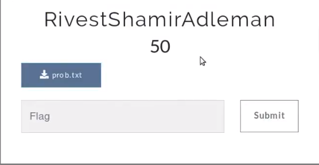

## Description
* **Name:**  [RivestShamirAdleman] (https://ctf.euristica.in/challenges#RivestShamirAdleman)
* **Artifact:** [Link](https://ctf.euristica.in/files/ea2daac3b2a8037cc9b9cbd0e7987765/prob.txt)
* **Points:** 50
* **Tag:** Crypto

<p align="center">

</p>

## Tools
* Firefox Version 60.6.1 https://www.mozilla.org/en-US/firefox/60.6.0/releasenotes/
* RsaCtfTool https://github.com/Ganapati/RsaCtfTool

## Writeup

```bash
root@1v4n:~/CTF/BBCTF19/crypto/RivestShamirAdleman# file prob.txt
prob.txt: ASCII text, with very long lines
root@1v4n:~/CTF/BBCTF19/crypto/RivestShamirAdleman# cat prob.txt
n = 22272129080562722886614022632205442705494455272860112814093083500097723366897651161029102178806468364810560145326674298943748926312059319333104024877629414355081997511170571841726554870330438449136414942769879449909945280622679982416961505259605748700527626064176345428348075666618966413358066674766244602120334405919054045097465042177827566762056612497539403392371174259602854649957161582616110665358774209954483243807893225011511670025850800717182535575577848500527430246259134071980979951803599863210705004134764027126983838884518704239682964897619030091789047630556807645411417077149617559860988186649846538955623
e = 3
ciphertext -----------------------
56274920108122478990888092521371739605513959053322262229138771723654033167756128122086229722406180593128664696512912311575327724724695863345048713415525599333
git clone https://github.com/Ganapati/RsaCtfTool.git
Clonando en 'RsaCtfTool'...
remote: Enumerating objects: 9, done.
remote: Counting objects: 100% (9/9), done.
remote: Compressing objects: 100% (9/9), done.
remote: Total 555 (delta 2), reused 4 (delta 0), pack-reused 546
Recibiendo objetos: 100% (555/555), 1.82 MiB | 2.62 MiB/s, listo.
Resolviendo deltas: 100% (290/290), listo.
root@1v4n:~/CTF/BBCTF19/crypto/RivestShamirAdleman#
root@1v4n:~/CTF/BBCTF19/crypto/RivestShamirAdleman_GRANTED# python RsaCtfTool/RsaCtfTool.py -n 22272129080562722886614022632205442705494455272860112814093083500097723366897651161029102178806468364810560145326674298943748926312059319333104024877629414355081997511170571841726554870330438449136414942769879449909945280622679982416961505259605748700527626064176345428348075666618966413358066674766244602120334405919054045097465042177827566762056612497539403392371174259602854649957161582616110665358774209954483243807893225011511670025850800717182535575577848500527430246259134071980979951803599863210705004134764027126983838884518704239682964897619030091789047630556807645411417077149617559860988186649846538955623 -e 3 --uncipher 56274920108122478990888092521371739605513959053322262229138771723654033167756128122086229722406180593128664696512912311575327724724695863345048713415525599333 | grep "flag{.*"
[+] Clear text : flag{nO_paDDing00_rsa}
```

### Flag

`flag{nO_paDDing00_rsa}`
