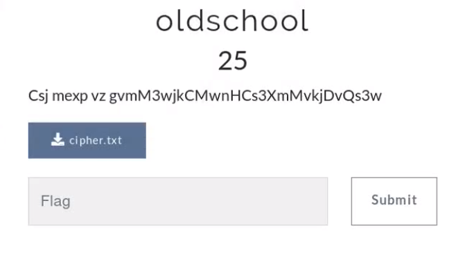
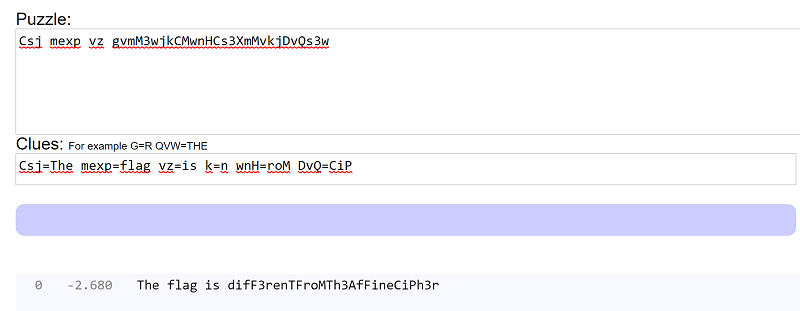

## Description
* **Name:**  [oldschool] (https://ctf.euristica.in/challenges#oldschool)
* **Artifact:** [Link](https://ctf.euristica.in/files/f100b5d6bfac2919f5e1d53315155d35/cipher.txt)
* **Points:** 25
* **Tag:** Crypto

<p align="center">

</p>

## Tools
* Firefox Version 60.6.1 https://www.mozilla.org/en-US/firefox/60.6.0/releasenotes/
* Cryptogram solver https://quipqiup.com/

## Writeup
The file called cipher.txt contains the following ciphertext
```bash
Csj mexp vz gvmM3wjkCMwnHCs3XmMvkjDvQs3w
```
We visited the automated cryptogram solver online tool quipqiup

<p align="center">

</p>
### Flag

`flag{difF3renTFroMTh3AfFineCiPh3r}`
