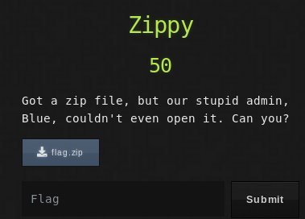

## Description
* **Name:** [Zippy](https://ctf.utsacyber.com/challenges#Zippy)
* **Artifact:** https://ctf.utsacyber.com/files/9027efdab1df3e4f4a894900c27b7bea/flag.zip
* **Points:** 50
* **Tag:** Forensics

<p align="center">

</p>

## Tools
* Firefox Version 60.5.1 https://www.mozilla.org/en-US/firefox/60.5.1/releasenotes/
* [N]Curses Hexedit 0.9.7 http://www.rogoyski.com/adam/programs/hexedit/
* 7zip https://www.7-zip.org/7z.html


## Writeup
We are going to unzip the compressed file flag.zip but we get an error. We note that the file signature has been modified

```bash
root@1v4n:~/CTF/CSACTF19/forensics/zippy# file flag.zip
flag.zip: Zip archive data, made by v?[0x31e], extract using at least v2.0, last modified Fri Sep 23 13:59:38 2011, uncompressed size 22, method=deflate
root@1v4n:~/CTF/CSACTF19/forensics/zippyD# md5sum flag.zip
061cefe907f401befd74f5e582d104ad  flag.zip
root@1v4n:~/CTF/CSACTF19/forensics/zippy_GRANTED# unzip flag.zip
Archive:  flag.zip
file #1:  bad zipfile offset (local header sig):  0
root@1v4n:~/CTF/CSACTF19/forensics/zippy# hexeditor flag.zip
File: flag.zip                                                                  ASCII Offset: 0x00000000 / 0x000000B9 (%00)  
00000000  00 00 00 00  14 00 02 00   08 00 CA 90  7C 4E 2B 7D                                                 ............|N+}
00000010  D2 2D 14 00  00 00 16 00   00 00 08 00  1C 00 66 6C                                                 .-............fl
00000020  61 67 2E 74  78 74 55 54   09 00 03 6B  53 9D 5C 6B                                                 ag.txtUT...kS.\k
00000030  53 9D 5C 75  78 0B 00 01   04 E8 03 00  00 04 E8 03                                                 S.\ux...........
00000040  00 00 73 0E  76 74 0E 71   AB AE 32 2C  28 A8 8C 07                                                 ..s.vt.q..2,(...
00000050  92 20 5C CB  05 00 50 4B   01 02 1E 03  14 00 02 00                                                 . \...PK........
00000060  08 00 CA 90  7C 4E 2B 7D   D2 2D 14 00  00 00 16 00                                                 ....|N+}.-......
00000070  00 00 08 00  18 00 00 00   00 00 01 00  00 00 A4 81                                                 ................
00000080  00 00 00 00  66 6C 61 67   2E 74 78 74  55 54 05 00                                                 ....flag.txtUT..
00000090  03 6B 53 9D  5C 75 78 0B   00 01 04 E8  03 00 00 04                                                 .kS.\ux.........
000000A0  E8 03 00 00  50 4B 05 06   00 00 00 00  01 00 01 00                                                 ....PK..........
000000B0  4E 00 00 00  56 00 00 00   00 00                                                                    N...V.....
```
We modified the [file signature](http://petlibrary.tripod.com/ZIP.HTM) of 00 00 00 00 > 50 4B 03 04 and saved it as flag_repair.zip
<p align="center">

</p>
```bash
File: flag.zip                                                                  ASCII Offset: 0x00000004 / 0x000000B9 (%02)  M
00000000  50 4B 03 04  14 00 02 00   08 00 CA 90  7C 4E 2B 7D                                                 PK..........|N+}
00000010  D2 2D 14 00  00 00 16 00   00 00 08 00  1C 00 66 6C                                                 .-............fl
00000020  61 67 2E 74  78 74 55 54   09 00 03 6B  53 9D 5C 6B                                                 ag.txtUT...kS.\k
00000030  53 9D 5C 75  78 0B 00 01   04 E8 03 00  00 04 E8 03                                                 S.\ux...........
00000040  00 00 73 0E  76 74 0E 71   AB AE 32 2C  28 A8 8C 07                                                 ..s.vt.q..2,(...
00000050  92 20 5C CB  05 00 50 4B   01 02 1E 03  14 00 02 00                                                 . \...PK........
00000060  08 00 CA 90  7C 4E 2B 7D   D2 2D 14 00  00 00 16 00                                                 ....|N+}.-......
00000070  00 00 08 00  18 00 00 00   00 00 01 00  00 00 A4 81                                                 ................
00000080  00 00 00 00  66 6C 61 67   2E 74 78 74  55 54 05 00                                                 ....flag.txtUT..
00000090  03 6B 53 9D  5C 75 78 0B   00 01 04 E8  03 00 00 04                                                 .kS.\ux.........
000000A0  E8 03 00 00  50 4B 05 06   00 00 00 00  01 00 01 00                                                 ....PK..........
000000B0  4E 00 00 00  56 00 00 00   00 00                                                                    N...V.....

root@1v4n:~/CTF/CSACTF19/forensics/zippy# file flag_repair.zip
flag_repair.zip: Zip archive data, at least v2.0 to extract
root@1v4n:~/CTF/CSACTF19/forensics/zippy# md5sum flag_repair.zip
eb4264c865a38184cb23836becdf24a7  flag_repair.zip
root@1v4n:~/CTF/CSACTF19/forensics/zippy# unzip flag.zip
Archive:  flag.zip
  inflating: flag.txt                
root@1v4n:~/CTF/CSACTF19/forensics/zippy# cat flag.
cat: flag.: No existe el fichero o el directorio
root@1v4n:~/CTF/CSACTF19/forensics/zippy# cat flag.txt
CSACTF{z1ppy_z1p_z1p}
```
### Flag

`CSACTF{z1ppy_z1p_z1p}`
