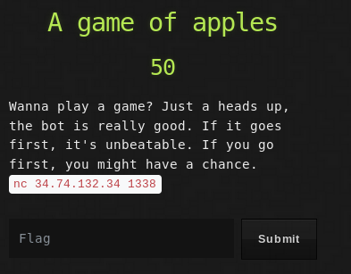

## Description
* **Name:** [A game of Apples](https://ctf.utsacyber.com/challenges#A%20game%20of%20apples)
* **Points:** 50
* **Tag:** Misc

<p align="center">

</p>

## Tools
* Firefox Version 60.5.1 https://www.mozilla.org/en-US/firefox/60.5.1/releasenotes/
* Netcat v1.10-41.1 https://bugs.launchpad.net/ubuntu/+source/netcat/1.10-41.1
* Python 2.7.16 https://www.python.org/downloads/release/python-2716/


## Writeup
We connect to the machine on IP 34.74.132.34 by Netcat on port 1338

```bash
root@1v4n:~# nc 34.74.132.34 1338
Let's play a simple game, you win if you empty the basket.
Ready?
[+] You go first
The basket has 967 apples
It's your turn. How many apples would you take [1-9]?
The basket has 958 apples
It's my turn. I take 4 apples
The basket has 954 apples
It's your turn. How many apples would you take [1-9]?
```
We find a script with a mathematical quiz that needs partial subtractions to get the result 0. If we do not get the goal "Ah ha.You lose.No flag for you." and if we get it, it will give us the flag that has the format CSACTF {...}

```bash
The basket has 9 apples
It's your turn. How many apples would you take [1-9]?
```
We write a simple brute force script that loops until it finds our flag

```bash
#! /bin/bash
while :
do
	python -c 'print("\n9"*1000)' |nc 34.74.132.34 1338 |grep "CSACTF{.*"
done
```

```bash
root@1v4n:~/CTF/CSACTF19/misc/gameofapples_GRANTED# ./get_flag.sh
Good job. You won. Here's the flag: CSACTF{0n3_4ppl3_tw0_4ppl3_thr33_4ppl3}
^C
root@1v4n:~/CTF/CSACTF19/misc/gameofapples_GRANTED#
```

### Flag

`CSACTF{0n3_4ppl3_tw0_4ppl3_thr33_4ppl3}`
