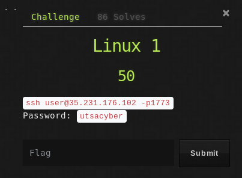

## Description
* **Name:**  [Linux 1] (https://ctf.utsacyber.com/challenges#Linux%201)
* **Points:** 50
* **Tag:** Misc

<p align="center">

</p>

## Tools
* Firefox Version 60.5.1 https://www.mozilla.org/en-US/firefox/60.5.1/releasenotes/
* OpenSSH_7.9p1 https://www.openssh.com/txt/release-7.9
* lsof 4.91 ftp://lsof.itap.purdue.edu/pub/tools/unix/lsof/


## Writeup
We connect to the machine on IP 35.231.176.102 by ssh on port 1773 with credentials `user:utsacyber`

```bash
root@1v4n:~# ssh user@35.231.176.102 -p1773
user@35.231.176.102's password:

_________   _________   _____  _______________________________
\_   ___ \ /   _____/  /  _  \ \_   ___ \__    ___/\_   _____/
/    \  \/ \_____  \  /  /_\  \/    \  \/ |    |    |    __)  
\     \____/        \/    |    \     \____|    |    |     \   
 \______  /_______  /\____|__  /\______  /|____|    \___  /   
        \/        \/         \/        \/               \/                                                                                                  
Welcome to CSACTF 2019!

If you find any problems, please report to admin.

-[ Rule ]-
 A few rules before you get started:
     + don't leave orphan processes running
     + don't leave exploit-files laying around
     + don't annoy other players
     + don't share passwords/solutions
     + last but not least, don't spoil the fun!

Have fun!
     - Blue
user@4ccc23ce0216:~$ whoami
user
user@4ccc23ce0216:~$ pwd
/home/user
user@4ccc23ce0216:~$ id
uid=1000(user) gid=1000(user) groups=1000(user)
```
We are facing a Docker container in a VM with OS Ubuntu in GCP. And we discovered a script called flag_reader.py in the directory `~/home/user/`

```bash
user@4ccc23ce0216:~$ ls -la
total 44
drwxr-xr-x 1 user user 4096 Apr 25 17:48 .
drwxr-xr-x 1 root root 4096 Apr 22 20:12 ..
-rw-r--r-- 1 user user  220 Aug 31  2015 .bash_logout
-rw-r--r-- 1 user user 3796 Apr 25 17:47 .bashrc
drwx------ 2 user user 4096 Apr 25 17:48 .cache
-rw-r--r-- 1 user user  655 May 16  2017 .profile
-rw-rw-r-- 1 user user    0 Apr 25 17:48 ahahaha
-rwxrwxr-x 1 root root  267 Apr 22 20:09 flag_reader.py
-rw-rw-r-- 1 root root   40 Apr 22 19:25 readme.txt
-rw-r--r-- 1 user user   19 Apr 25 17:47 temp.txt
user@4ccc23ce0216:~$ uname -a
Linux 4ccc23ce0216 4.15.0-1029-gcp #31-Ubuntu SMP Thu Mar 21 09:40:28 UTC 2019 x86_64 x86_64 x86_64 GNU/Linux
```
We note that the script needs the existence of a file called flag.txt that has been deleted.
```bash
user@4ccc23ce0216:~$ ./flag_reader.py         
Traceback (most recent call last):
  File "./flag_reader.py", line 5, in <module>
    f = open('flag.txt', 'r')
IOError: [Errno 2] No such file or directory: 'flag.txt'
user@4ccc23ce0216:~$ cat flag_reader.py
#!/usr/bin/python
import time
import os

f = open('flag.txt', 'r')

# ==== Reading the flag
flag = f.read()
with open('temp.txt','w') as tmp:
  tmp.write('Reading the flag...')

#print flag
time.sleep(99999)

# ==== Done, Cleaning up
os.remove('temp.txt')

f.close()
```
[Investigating] (https://unix.stackexchange.com/questions/101237/how-to-recover-files-i-deleted-now-by-running-rm/101297) the possibility that the running program has the deleted file open, we can recover the file through the file descriptor opened in `/proc/[pid]/fd/[num]`

```bash
user@4ccc23ce0216:~$ lsof | grep "/home/user/"
python   12 user    3r      REG   0,80       37  774243 /home/user/flag.txt (deleted)
```
And there we have our file with the flag that we are going to recover
```bash
user@4ccc23ce0216:~$ cp /proc/12/fd/3 /home/user/flag.txt
user@4ccc23ce0216:~$ cat flag.txt
CSACTF{f34r_cuts_d33p3r_th4n_sw0rds}
```

### Flag

`CSACTF{f34r_cuts_d33p3r_th4n_sw0rds}`
