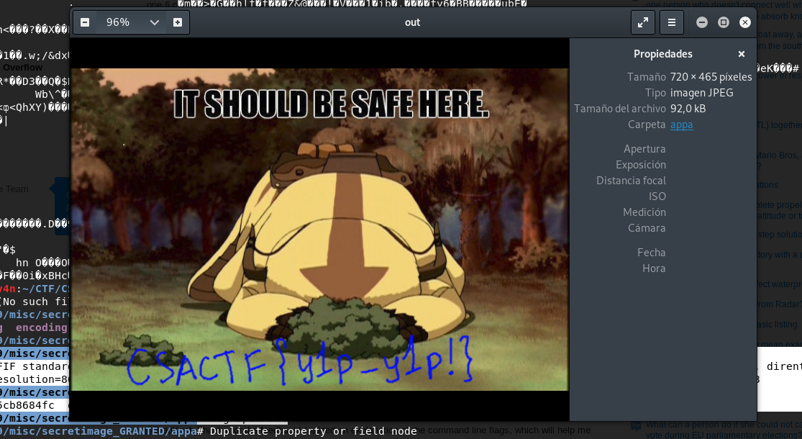

## Description
* **Name:** [stephanography] (https://ctf.utsacyber.com/challenges#stephanography)
* **Points:** 50
* **Tag:** Misc

<p align="center">

</p>

## Tools
* Firefox Version 60.5.1 https://www.mozilla.org/en-US/firefox/60.5.1/releasenotes/
* pngcheck http://www.libpng.org/pub/png/apps/pngcheck.html
* Stego-Toolkit
https://github.com/DominicBreuker/stego-toolkit


## Writeup
We downloaded through the link in the bottom left of the screen the file called secret_image.png (f44420ba5d70d25ff35075b58df44641) and we made a preliminary analysis:

```bash
root@1v4n:~/CTF/CSACTF19/misc/stephanography# md5sum secret_new.png
f44420ba5d70d25ff35075b58df44641  secret_new.png
root@1v4n:~/CTF/CSACTF19/misc/stephanography# pngcheck secret_new.png
OK: secret_new.png (1000x1223, 24-bit RGB, non-interlaced, 86.8%).
root@1v4n:~/CTF/CSACTF19/misc/stephanography# exiftool secret_new.png
ExifTool Version Number         : 11.16
File Name                       : secret_new.png
Directory                       : .
File Size                       : 473 kB
File Modification Date/Time     : 2019:04:25 22:24:25+02:00
File Access Date/Time           : 2019:05:28 20:47:42+02:00
File Inode Change Date/Time     : 2019:05:28 20:47:37+02:00
File Permissions                : rwxrwx---
File Type                       : PNG
File Type Extension             : png
MIME Type                       : image/png
Image Width                     : 1000
Image Height                    : 1223
Bit Depth                       : 8
Color Type                      : RGB
Compression                     : Deflate/Inflate
Filter                          : Adaptive
Interlace                       : Noninterlaced
Image Size                      : 1000x1223
Megapixels                      : 1.2
root@1v4n:~/CTF/CSACTF19/misc/stephanography# strings secret_new.png
IHDR
IDATx
RUr
1FfF
...
P2h6
mH.zS
kuvv
6GFFn
D-u%
Ea{]
IEND
root@1v4n:~/CTF/CSACTF19/misc/stephanography# binwalk secret_new.png

DECIMAL       HEXADECIMAL     DESCRIPTION
--------------------------------------------------------------------------------
0             0x0             PNG image, 1000 x 1223, 8-bit/color RGB, non-interlaced
41            0x29            Zlib compressed data, default compression
```
The challenge tells us that the "... undercover agent, Steph (code name: stncal), now uses a steg tool on Github called" Appa "...". Therefore we can be in front of a carrier image of a hidden secret message with a steganographic tool. Before moving to OSINT in Github we passed the tool stego-toolkit that will throw us possible positives:

```bash

root@1v4n:~/Stego/stego-toolkit/scripts# ./check_png.sh ~/CTF/CSACTF19/misc/stephanography/secret_new.png
....
###########################
########## zsteg ##########
###########################

Watch out for red output. This tool shows lots of false positives...
imagedata           .. text: "POOnooAA@"
b2,g,msb,xy         .. text: "UUuUUuUUU"
b2,rgb,msb,xy       .. text: "WU_U}U}}"
b4,g,msb,xy         .. text: ["w" repeated 8 times]
b4,b,msb,xy         .. file: MPEG ADTS, layer I, v2, 112 kbps, Monaural
b4,bgr,msb,xy       .. file: MPEG ADTS, layer I, v2, 112 kbps, 24 kHz, JntStereo
b5,b,lsb,xy         .. file: MPEG ADTS, layer II, v1, Monaural
b5,bgr,lsb,xy       .. file: MPEG ADTS, layer II, v1, JntStereo
b6,g,msb,xy         .. file: MPEG ADTS, layer I, v2, Monaural
b7,g,lsb,xy         .. file: , 48 kHz, Monaural
b8,r,msb,xy         .. file: RDI Acoustic Doppler Current Profiler (ADCP)
b8,b,msb,xy         .. file: ddis/ddif
b8,bgr,msb,xy       .. file: ddis/ddif
b1,bgr,msb,xy,prime .. text: "MBl+W4hB"
b2,g,msb,xy,prime   .. text: "uUUUU]UUuW]"
b2,b,msb,xy,prime   .. text: "_UUUUUUuUWUUWUUUUUU]UUUU]UwUUUWUuUUUwUUUU]Uu"
b2,rgb,msb,xy,prime .. text: "UWuWWUwU"
b2,bgr,msb,xy,prime .. text: "UuuWuuuU"
b4,r,msb,xy,prime   .. file: RDI Acoustic Doppler Current Profiler (ADCP)
b4,g,msb,xy,prime   .. text: ["w" repeated 8 times]
b4,b,msb,xy,prime   .. text: ["w" repeated 14 times]
b5,r,msb,xy,prime   .. file: MPEG ADTS, layer II, v1, 48 kHz, Monaural
b6,r,msb,xy,prime   .. file: MPEG ADTS, layer I, v2, 112 kbps, Monaural
b6,rgb,msb,xy,prime .. file: MPEG ADTS, layer I, v2, 112 kbps, Monaural
b7,r,lsb,xy,prime   .. file: , Monaural
b7,rgb,lsb,xy,prime .. file: , 48 kHz, Monaural
b8,rgb,lsb,xy,prime .. file: AIX core file 64-bit
b8,bgr,msb,xy,prime .. file: RDI Acoustic Doppler Current Profiler (ADCP)
b2,r,msb,yx         .. text: "uU_Uu_UU"
b2,g,msb,yx         .. text: "UWwUwU]WwU"
b2,rgb,msb,yx       .. text: "WU]_u}Uw"
b3,bgr,lsb,yx       .. file: very old 16-bit-int big-endian archive
b4,g,msb,yx         .. file: RDI Acoustic Doppler Current Profiler (ADCP)
b5,g,msb,yx         .. file: MPEG ADTS, layer II, v1, 48 kHz, Monaural
b5,bgr,lsb,yx       .. file: MPEG ADTS, layer II, v1, 384 kbps, JntStereo
b6,g,msb,yx         .. file: MPEG ADTS, layer I, v2, 112 kbps, Monaural
b6,b,msb,yx         .. file: MPEG ADTS, layer I, v2, Monaural
b7,g,lsb,yx         .. file: , Monaural
b7,b,lsb,yx         .. file: , 48 kHz, Monaural
b8,bgr,msb,yx       .. file: ddis/ddif
b1,bgr,lsb,yx,prime .. <wbStego size=283504, data="4\xC3M\x9A\e\x82\xB8Qu\x1A\xD1TUi$ \xCAd\na(2K\x10\x01UE@\x88t\x88\xA0\x04\xDA?\xFF\xFF\xFF\xFF\xFF\xFF\xFF\xFF\xFF\xFF\xFF\xFF\xFF\xFF\xFF\xFF\xFF\xFF\xFF\xFF\xFF\xFF\xFF\xFF\xFF\xFF\xFF\xFF\xFF\xFF\xFF\xFF\xFF\xFF\xFF\xFC\xB2J1\eX,\xD4\t\x1E\x92\b4\xD6HM\x9Bbp\xC7K\x03\x90\xCDt\xB2\x88\xE4\x9BO\xFF\xFF\xFF\xFF\xFF\xFF\xFF\xFF\xFF\xFF\xFF\xFF\xFF\xFF\xFF\xFF\xFF\xFF\xFF\xFF\xFF\xFF\xFF\xFF\xFF\xFF\xFF\xFF\xFF\xFF\xFF\xFEF\xA09\xC8\x96\x8F\t\f9\x95\x94\xC75\x86PL\xDC0\xE8V\xCAH&\x12E\x17\xFF\xFF\xFF\xFF\xFF\xFF\xFF\xFF\xFF\xFF\xFF\xFF\xFF\xFF\xFF\xFF\xFF\xFF\xFF\xFF\xFF\xFF\xFF\xFF\xFF\xFF\xFF\xFF\xFF\xF8\xA2B\xD0\xA4*\xA8B\x82B\x80@I6\x90\x1Ch\xC6\xC9H\x93\x1DB\x92\v\x04\x7F\xFF\xFF\xFF\xFF\xFF\xFF\xFF\xFF\xFF\xFF\xFF\xFF\xFF\xFF\xFF\xFF\xFF\xFF\xFF\xFF\xFF\xFF\xFF\xFF\xFF\xFF\xFF\xF4\x93\x19#\xC7M\\\xBA\x9D\xA1r", even=false, mix=true, controlbyte="H">
b2,r,msb,yx,prime   .. text: "UU}w]UUU"
b2,g,msb,yx,prime   .. text: "UUUu___uW"
b2,b,msb,yx,prime   .. text: "UUUWwW]W"
b2,bgr,msb,yx,prime .. text: "u]uU_w}]Uw}"
b3,rgb,lsb,yx,prime .. file: very old 16-bit-int big-endian archive
b4,r,msb,yx,prime   .. text: ["w" repeated 8 times]
b5,rgb,lsb,yx,prime .. file: MPEG ADTS, layer II, v1, 384 kbps, JntStereo
b6,r,msb,yx,prime   .. file: MPEG ADTS, layer I, v2, Monaural
b6,g,msb,yx,prime   .. file: MPEG ADTS, layer I, v2, 112 kbps, Monaural
b7,r,lsb,yx,prime   .. file: , 48 kHz, Monaural
b7,g,lsb,yx,prime   .. file: , 48 kHz, Monaural
b8,rgb,msb,yx,prime .. file: ddis/ddif
b2,r,msb,YX         .. text: "]_u}WW]]wUW"
b2,g,msb,YX         .. text: "WUUwu]w}"
b1,bgr,msb,YX,prime .. text: "A8MQ<Mf(,1"
b2,b,msb,YX,prime   .. text: "UWU}U}UUU"
b1,g,msb,Xy         .. file: Targa image data - RLE 384 x 64 x 32 +16448 - 8-bit alpha - interleave
b2,g,lsb,Xy         .. file: 5View capture file
b2,g,msb,Xy         .. file: VISX image file
b2,rgb,msb,Xy       .. text: "WWUW]]uu"
b4,g,msb,Xy         .. text: ["w" repeated 9 times]
b6,b,msb,Xy         .. file: MPEG ADTS, layer I, v2, Monaural
b6,bgr,msb,Xy       .. file: MPEG ADTS, layer I, v2, 112 kbps, Monaural
b7,b,lsb,Xy         .. file: , 48 kHz, Monaural
b7,bgr,lsb,Xy       .. file: , 48 kHz, Monaural
b8,r,msb,Xy         .. file: RDI Acoustic Doppler Current Profiler (ADCP)
b8,g,msb,Xy         .. file: RDI Acoustic Doppler Current Profiler (ADCP)
b8,rgb,msb,Xy       .. file: RDI Acoustic Doppler Current Profiler (ADCP)
b1,g,lsb,Xy,prime   .. file: shared library
b1,rgb,lsb,Xy,prime .. text: ")&Pa'HaE"
b2,g,msb,Xy,prime   .. text: "U]UUUUuuU]UwUUW]UUUwUUUUUuU"
b2,b,msb,Xy,prime   .. text: "]UUUUUUUUUwUUUU]UUUWUUUUU]"
b2,rgb,msb,Xy,prime .. text: "W}UWu}WUUWw]WU]Uu]"
b2,bgr,msb,Xy,prime .. text: "WuWuUUuU"
b4,r,msb,Xy,prime   .. file: RDI Acoustic Doppler Current Profiler (ADCP)
b4,g,msb,Xy,prime   .. text: ["w" repeated 8 times]
b4,b,msb,Xy,prime   .. text: ["w" repeated 19 times]
b5,r,msb,Xy,prime   .. file: MPEG ADTS, layer II, v1, 48 kHz, Monaural
b6,r,msb,Xy,prime   .. file: MPEG ADTS, layer I, v2, 112 kbps, Monaural
b6,rgb,msb,Xy,prime .. file: MPEG ADTS, layer I, v2, 112 kbps, Monaural
b7,r,lsb,Xy,prime   .. file: , Monaural
b7,rgb,lsb,Xy,prime .. file: , 48 kHz, Monaural
b8,g,msb,Xy,prime   .. file: RDI Acoustic Doppler Current Profiler (ADCP)
b8,bgr,msb,Xy,prime .. file: RDI Acoustic Doppler Current Profiler (ADCP)
b1,r,lsb,yX         .. text: "Q,$PH0Il"
b1,bgr,lsb,yX       .. file: PGP\011Secret Key -
b2,r,msb,yX         .. text: "WuUw]]uu_W}"
b2,g,msb,yX         .. text: "]u]_w]WwUU"
b4,b,msb,yX         .. file: MPEG ADTS, layer I, v2, 112 kbps, 24 kHz, JntStereo
b5,b,lsb,yX         .. file: MPEG ADTS, layer II, v1, JntStereo
b6,bgr,msb,yX       .. file: MPEG ADTS, layer I, v2, Monaural
b7,rgb,lsb,yX       .. file: AIX core file fulldump 32-bit
b7,bgr,lsb,yX       .. file: , 48 kHz, Monaural
b8,g,msb,yX         .. file: RDI Acoustic Doppler Current Profiler (ADCP)
b8,b,msb,yX         .. file: ddis/ddif
b8,rgb,msb,yX       .. file: RDI Acoustic Doppler Current Profiler (ADCP)
b2,b,msb,yX,prime   .. text: "]UWUWU]]U"
b2,bgr,msb,yX,prime .. text: "wU]W]]w}w]wuUw"
b3,rgb,lsb,yX,prime .. file: very old 16-bit-int big-endian archive
b4,b,msb,yX,prime   .. text: ["w" repeated 9 times]
b5,rgb,lsb,yX,prime .. file: MPEG ADTS, layer II, v1, 384 kbps, JntStereo
b6,r,msb,yX,prime   .. file: MPEG ADTS, layer I, v2, 112 kbps, Monaural
b6,g,msb,yX,prime   .. file: MPEG ADTS, layer I, v2, 112 kbps, Monaural
b7,r,lsb,yX,prime   .. file: , 48 kHz, Monaural
b7,g,lsb,yX,prime   .. file: , 48 kHz, Monaural
b8,g,lsb,yX,prime   .. file: AIX core file 64-bit
b8,rgb,msb,yX,prime .. file: ddis/ddif
b2,r,msb,Yx         .. text: "u]UUWu}_"
b2,g,msb,Yx         .. text: "uUWUUUUU]]"
b2,bgr,msb,Yx,prime .. text: "Wu]_}u}}UW"
...
#################################
########## stegano-red ##########
#################################
þÿþþÿþþþþÿþþþÿþþÿþþþþÿþþÿþþÿþþÿþþÿþþÿþþþþþÿþþÿÿþÿþþÿþþÿþþÿÿþÿþþÿþþÿþþÿþþÿþþÿþþÿþþÿþþÿþþÿþþÿþþÿþþÿþþÿþþÿþþÿþþÿþþÿþþÿþþÿþþþÿþþÿþþþþÿþþÿþþÿþþþÿþþÿþÿþþÿþþÿÿþÿþþÿÿþÿþþÿÿþÿÿþÿþþÿþþÿþþÿþþþÿþÿþþÿþþÿþþÿþþÿÿþþþþÿþþÿþþÿþþÿþþÿþþÿþþÿþþÿþþÿþþÿþþÿþþÿÿþÿþþÿþþÿþþÿÿþÿþþÿþ
...
```
We locate the repository of the tool "appa" with a simple google search from the terminal at https://github.com/stncal/appa

```bash
root@1v4n:~/CTF/CSACTF19/misc/stephanography# google site:github.com "stncal" "appa" steganography
https://github.com/stncal/appa
https://github.com/topics/steganography?l=python&o=desc&s=updated
https://github.com/stncal/appa/wiki
https://github.com/topics/steganography?o=desc&s=updated
https://npm.pkg.github.com/topics/steganography?o=desc&s=updated
https://github.com/notacatkiller?tab=stars
https://github.com/topics/steganography?utf8=%E2%9C%93&after=Y3Vyc29yOjYw
https://rubygems.pkg.github.com/topics/pillow?l=python&o=desc&s=updated
```
Download the repository through git clone https://github.com/stncal/appa.git and install your dependencies pip3 install Pillow. We went to decode the carrier image from which we get a hexadecimal message which we will reverse:

```bash

root@1v4n:~/CTF/CSACTF19/misc/stephanography# python3 appa/appa.py -d secret_new.png
==> Decoding image: True

==> Pixel data
	First 3 pixels/possible text: [(254, 255, 255), (254, 254, 255), (255, 254, 254)]
...
Appa found an extremely large string in the image. To save your console, results are saved to file: secret_new.results
String length: 187142
root@1v4n:~/CTF/CSACTF19/misc/stephanography/appa# cat secret_new.results | xxd -r -p > out
```
And here we get our flag in the image out (a2e6b150c179bb8063bcd635cb8684fc)

```bash
root@1v4n:~/CTF/CSACTF19/misc/stephanography/appa# file out
out: JPEG image data, JFIF standard 1.01, resolution (DPI), density 72x72, segment length 16, Exif Standard: [TIFF image data, little-endian, direntries=6, orientation=upper-left, xresolution=86, yresolution=94, resolutionunit=2, software=GIMP 2.8.22], progressive, precision 8, 720x465, components 3
root@1v4n:~/CTF/CSACTF19/misc/stephanography/appa# md5sum out
a2e6b150c179bb8063bcd635cb8684fc  out
root@1v4n:~/CTF/CSACTF19/misc/stephanography/appa# xdg-open out
```
<p align="center">

</p>

### Flag

`CSACTF{y1p-y1p!}`
