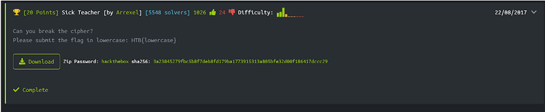
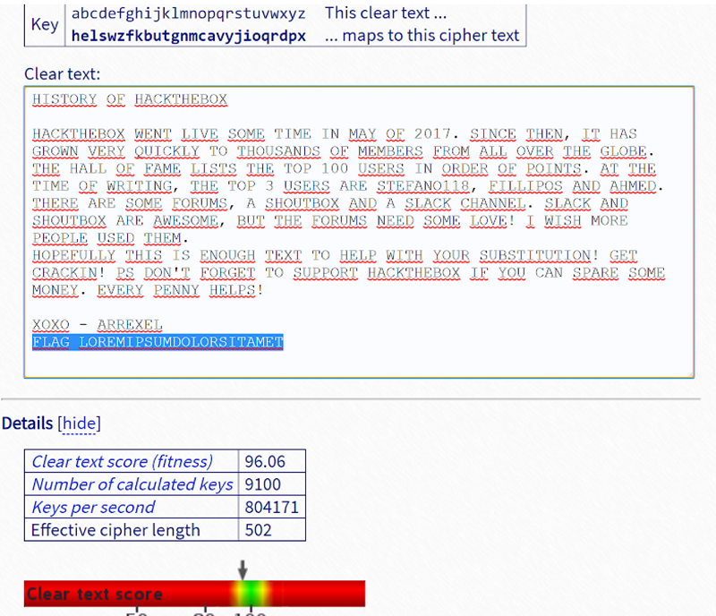

## Descripción
* **Nombre:** [Sick Teacher](https://www.hackthebox.eu/home/challenges/Crypto)
* **F.Liberación** 22 de agosto de 2017 [retired]
* **Autor** [Arrexel](https://www.hackthebox.eu/home/users/profile/2904)
* **Tag:** Crypto

Can you break the cipher?

## Objetivo
* Formato de flag: `HTB{lowercase}`

## Herramientas
* Chrome Versión 71.0.3578.98 (Build oficial) (64 bits) https://www.google.com/chrome/
* wget (1.19.5) https://www.gnu.org/software/wget/
* UnZip 6.00 ftp://ftp.info-zip.org/pub/infozip/
* Cryptanalysis https://github.com/DominicBreuker/cryptanalysis
* Substitution Solver https://www.guballa.de/substitution-solver

## Resumen
Comenzamos por visitar la página del reto y descargamos el archivo comprimido .zip que nos dan como artefacto y que tiene la password *hackthebox*

<p align="center">

</p>

Descargamos a través del link en la parte inferior izquierda de la pantalla o utilizamos con wget la descarga del archivo llamado *SickTeacher.zip*

```bash
root@kali:~/Escritorio/Desktop/C-HTB/Crypto/SickTeacher# wget https://www.hackthebox.eu/storage/challenges/crypto/SickTeacher.zip
https://www.hackthebox.eu/storage/challenges/crypto/SickTeacher.zip
Resolviendo www.hackthebox.eu (www.hackthebox.eu)... 104.24.0.54, 104.24.1.54
Conectando con www.hackthebox.eu (www.hackthebox.eu)[104.24.0.54]:443... conectado.
Petición HTTP enviada, esperando respuesta... 200 OK
Longitud: 558 [application/zip]
Grabando a: "SickTeacher.zip"
SickTeacher.zip     100%[===================>]     558  --.-KB/s    en 0s  
(2,77 MB/s) - "SickTeacher.zip" guardado [558/558]
```
Al descargar el archivo *DaVinci.zip* pasamos a descomprimirlo con **unzip**:
```bash
root@kali:~/Escritorio/Desktop/C-HTB/Crypto/SickTeacher# unzip SickTeacher.zip
Archive:  SickTeacher.zip
[SickTeacher.zip] SickTeacher.txt password:
  inflating: SickTeacher.txt
```
observar que guarda un (1) archivos con extensión .txt **ASCII text**

```bash
root@kali:~/Escritorio/Desktop/C-HTB/Crypto/SickTeacher# file SickTeacher.txt
SickTeacher.txt: ASCII text, with CRLF line terminators
root@kali:~/Escritorio/Desktop/C-HTB/Crypto/SickTeacher# cat SickTeacher.txt
KBJICYP CZ KHLTIKWECD

KHLTIKWECD RWMI GBQW JCNW IBNW BM NHP CZ 2017. JBMLW IKWM, BI KHJ FYCRM QWYP VOBLTGP IC IKCOJHMSJ CZ NWNEWYJ ZYCN HGG CQWY IKW FGCEW.
IKW KHGG CZ ZHNW GBJIJ IKW ICA 100 OJWYJ BM CYSWY CZ ACBMIJ. HI IKW IBNW CZ RYBIBMF, IKW ICA 3 OJWYJ HYW JIWZHMC118, ZBGGBACJ HMS HKNWS.
IKWYW HYW JCNW ZCYONJ, H JKCOIECD HMS H JGHLT LKHMMWG. JGHLT HMS JKCOIECD HYW HRWJCNW, EOI IKW ZCYONJ MWWS JCNW GCQW! B RBJK NCYW AWCAGW OJWS IKWN.
KCAWZOGGP IKBJ BJ WMCOFK IWDI IC KWGA RBIK PCOY JOEJIBIOIBCM! FWI LYHLTBM! AJ SCM'I ZCYFWI IC JOAACYI KHLTIKWECD BZ PCO LHM JAHYW JCNW NCMWP. WQWYP AWMMP KWGAJ!

DCDC - HYYWDWG
ZGHF GCYWNBAJONSCGCYJBIHNWI
```
Observamos que estamos ante un cifrado por sustitución. Pasamos a utilizar la herramienta [Cryptanalysis](https://github.com/DominicBreuker/cryptanalysis)

```bash
root@kali:~/Escritorio/Desktop/C-HTB/Crypto/SickTeacher/cryptanalysis# python3 main.py
HISTORY OF HACKTHEJOB

HACKTHEJOB WENT LIVE SOME TIME IN MAY OF 2017. SINCE THEN, IT HAS GROWN VERY QUICKLY TO THOUSANDS OF MEMJERS FROM ALL OVER THE GLOJE.
THE HALL OF FAME LISTS THE TOP 100 USERS IN ORDER OF POINTS. AT THE TIME OF WRITING, THE TOP 3 USERS ARE STEFANO118, FILLIPOS AND AHMED.
THERE ARE SOME FORUMS, A SHOUTJOB AND A SLACK CHANNEL. SLACK AND SHOUTJOB ARE AWESOME, JUT THE FORUMS NEED SOME LOVE! I WISH MORE PEOPLE USED THEM.
HOPEFULLY THIS IS ENOUGH TEBT TO HELP WITH YOUR SUJSTITUTION! GET CRACKIN! PS DON'T FORGET TO SUPPORT HACKTHEJOB IF YOU CAN SPARE SOME MONEY. EVERY PENNY HELPS!

BOBO - ARREBEL
FLAG LOREMIPSUMDOLORSITAMET
---
```
Podemos también utilizar la tool online [Substitution Solver](https://www.guballa.de/substitution-solver) configurando que el texto está en inglés
<p align="center">

</p>

```
### Flag

La flag es: `HTB{loremipsumdoloritamet}`
