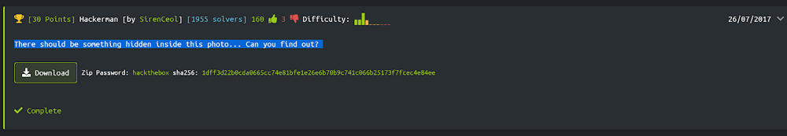

## Descripción
* **Nombre:** [Hackerman](https://www.hackthebox.eu/home/challenges/Stego)
* **F.Liberación** 26 de julio de 2017 [retired]
* **Autor** [SirenCeol](https://www.hackthebox.eu/home/users/profile/2277)
* **Tag:** Stego

There should be something hidden inside this photo... Can you find out?

## Objetivo
* Formato de flag: `HTB{s0m3_t3xt}`

## Herramientas
* Chrome Versión 68.0.3440.106 (Build oficial) (64 bits) https://www.google.com/chrome/
* wget (1.19.5) https://www.gnu.org/software/wget/
* UnZip 6.00 ftp://ftp.info-zip.org/pub/infozip/
* Stego Toolkit https://github.com/DominicBreuker/stego-toolkit/tree/master
* Hasher 3.0.1 (alpha) https://github.com/ciku370
googler 3-6
* https://md5online.org
* https://29a.ch/photo-forensics/#forensic-magnifier
* https://gchq.github.io/CyberChef/

## Resumen
Comenzamos por visitar la página del reto y descargamos el archivo comprimido .zip que nos dan como artefacto y que tiene la password *hackthebox*

<p align="center">

</p>

Descargamos en la parte inferior izquierda de la pantalla o utilizamos con wget la descarga del archivo llamado *DaVinci.zip*:

```bash
root@kali:~/Desktop/HTB/Stego/Hackerman# wget https://www.hackthebox.eu/storage/challenges/stego/hackerman.zip
--2018-08-08 23:59:47--  https://www.hackthebox.eu/storage/challenges/stego/hackerman.zip
Resolviendo www.hackthebox.eu (www.hackthebox.eu)... 104.24.1.54, 104.24.0.54, 2400:cb00:2048:1::6818:136, ...
Conectando con www.hackthebox.eu (www.hackthebox.eu)[104.24.1.54]:443... conectado.
Petición HTTP enviada, esperando respuesta... 200 OK
Longitud: 115363 (113K) [application/zip]
Grabando a: "hackerman.zip.1"
hackerman.zip.1     100%[===================>] 112,66K  --.-KB/s    en 0,06s   
2018-08-08 23:59:47 (1,79 MB/s) - "hackerman.zip.1" guardado [115363/115363]
root@kali:~/Desktop/HTB/Stego/Hackerman#
```
Al descargar el archivo *DaVinci.zip* pasamos a descomprimirlo con **unzip**:
```bash
Archive:  hackerman.zip
[hackerman.zip] hackerman.jpg password:
  inflating: hackerman.jpg           
root@kali:~/Desktop/HTB/Stego/Hackerman#
```
Podemos observar que guardaba un (1) archivo con extensión jpg. Realizamos el análisis inicial forense y el estegoanálisis de *hackerman.jpg*****:

```root@kali:~/Desktop/HTB/Stego/Hackerman/stego-toolkit/scripts# ./check_jpg.sh hackerman.jpg

#################################
########## JPG CHECKER ##########
#################################
Checking file hackerman.jpg

file hackerman.jpg:
hackerman.jpg: JPEG image data, JFIF standard 1.01, aspect ratio, density 1x1, segment length 16, baseline, precision 8, 960x540, frames 3
identify hackerman.jpg:
Image: hackerman.jpg
  Format: JPEG (Joint Photographic Experts Group JFIF format)
  Mime type: image/jpeg
  Class: DirectClass
  Geometry: 960x540+0+0
  Units: Undefined
  Colorspace: sRGB
  Type: TrueColor
  Base type: Undefined
  Endianess: Undefined
  Depth: 8-bit
  Channel depth:
    red: 8-bit
    green: 8-bit
    blue: 8-bit
  Channel statistics:
    Pixels: 518400
    Red:
      min: 0  (0)
      max: 255 (1)
      mean: 71.2629 (0.279462)
      standard deviation: 43.9857 (0.172493)
      kurtosis: 1.17462
      skewness: 1.14268
      entropy: 0.899253
    Green:
      min: 0  (0)
      max: 255 (1)
      mean: 53.7318 (0.210713)
      standard deviation: 43.397 (0.170184)
      kurtosis: 1.60969
      skewness: 1.44128
      entropy: 0.875724
    Blue:
      min: 0  (0)
      max: 255 (1)
      mean: 95.8043 (0.375703)
      standard deviation: 39.7921 (0.156048)
      kurtosis: 0.6856
      skewness: 0.912278
      entropy: 0.896498
  Image statistics:
    Overall:
      min: 0  (0)
      max: 255 (1)
      mean: 73.5997 (0.288626)
      standard deviation: 42.3916 (0.166242)
      kurtosis: 0.456978
      skewness: 0.885334
      entropy: 0.890491
  Rendering intent: Perceptual
  Gamma: 0.454545
  Chromaticity:
    red primary: (0.64,0.33)
    green primary: (0.3,0.6)
    blue primary: (0.15,0.06)
    white point: (0.3127,0.329)
  Background color: white
  Border color: srgb(223,223,223)
  Matte color: grey74
  Transparent color: black
  Interlace: None
  Intensity: Undefined
  Compose: Over
  Page geometry: 960x540+0+0
  Dispose: Undefined
  Iterations: 0
  Compression: JPEG
  Quality: 92
  Orientation: Undefined
  Properties:
    date:create: 2018-08-09T00:03:36+02:00
    date:modify: 2017-07-26T08:52:10+02:00
    jpeg:colorspace: 2
    jpeg:sampling-factor: 1x1,1x1,1x1
    signature: ffcf5f3136e03c226f001c363ff8237094ed87c35e1b967f2bcad5fc48346c8b
  Artifacts:
    filename: hackerman.jpg
    verbose: true
  Tainted: False
  Filesize: 122075B
  Number pixels: 518400
  Pixels per second: 51.84MB
  User time: 0.010u
  Elapsed time: 0:01.009
  Version: ImageMagick 6.9.10-2 Q16 x86_64 20180618 https://www.imagemagick.org

##############################
########## exiftool ##########
##############################
ExifTool Version Number         : 11.06
File Name                       : hackerman.jpg
Directory                       : .
File Size                       : 119 kB
File Modification Date/Time     : 2017:07:26 08:52:10+02:00
File Access Date/Time           : 2018:08:09 00:05:03+02:00
File Inode Change Date/Time     : 2018:08:09 00:03:36+02:00
File Permissions                : rw-r--r--
File Type                       : JPEG
File Type Extension             : jpg
MIME Type                       : image/jpeg
JFIF Version                    : 1.01
Resolution Unit                 : None
X Resolution                    : 1
Y Resolution                    : 1
Image Width                     : 960
Image Height                    : 540
Encoding Process                : Baseline DCT, Huffman coding
Bits Per Sample                 : 8
Color Components                : 3
Y Cb Cr Sub Sampling            : YCbCr4:4:4 (1 1)
Image Size                      : 960x540
Megapixels                      : 0.518

#############################
########## binwalk ##########
#############################

DECIMAL       HEXADECIMAL     DESCRIPTION
--------------------------------------------------------------------------------
0             0x0             JPEG image data, JFIF standard 1.01


################################
########## stegdetect ##########
################################
./check_jpg.sh: línea 63: stegdetect: no se encontró la orden

#############################
########## strings ##########
#############################
JFIF
$3br
%&'()*456789:CDEFGHIJSTUVWXYZcdefghijstuvwxyz
	#3R
&'()*56789:CDEFGHIJSTUVWXYZcdefghijstuvwxyz
qA,L
$JvC7
WMJp
52MnI""l
....
5634275d694f8665957746c9619132f0

##############################
########## steghide ##########
##############################
steghide: 'no pude extraer ning'n dato con ese salvoconducto!

##############################
########## outguess ##########
##############################
./check_jpg.sh: línea 86: outguess: no se encontró la orden
Nothing found...

###################################
########## outguess-0.13 ##########
###################################
./check_jpg.sh: línea 94: outguess-0.13: no se encontró la orden
Nothing found...

###########################
########## jsteg ##########
###########################
./check_jpg.sh: línea 102: jsteg: no se encontró la orden
Nothing found...

##################################
########## stegoVeritas ##########
##################################
./check_jpg.sh: línea 113: stegoveritas.py: no se encontró la orden
```
Pasamos a analizar el hash 5634275d694f8665957746c9619132f0 que obtenemos con la herramienta *hasher*

```root@kali:~/Desktop/HTB/Stego/Hackerman/hasher# python2 hash.py
              Hash Cracker 3.0.1
  ------------------------------------------
  88  88    db    .dP"Y8 88  88 88888 88""Yb
  88  88   dPYb   `Ybo." 88  88 88__  88__dP
  888888  dP__Yb  o.`Y8b 888888 88""  88"Yb  
  88  88 dP""""Yb 8bodP  88  88 88888 88  Yb
  ------------------------------------------
            python2 hash.py --info
[?] Hash : 5634275d694f8665957746c9619132f0
[=] Cek Hash Type ...
   [01] md4
   [02] md5
   [03] Nthash
   [04] Lmhash
   [05] Ntlm hash
[?] Choose Hash >>> 2
[=] open google
[*] Start ...
[00:00:00] Searching...
[00:00:00] Stopped...
[=] password found
[+] 5634275d694f8665957746c9619132f0 0={==> almost
```
Ya he conseguido la clave para extraer el secreto de la imagen. Pasamos *steghide*
```root@kali:~/Desktop/HTB/Stego/Hackerman# steghide info hackerman.jpg
"hackerman.jpg":
  formato: jpeg
  capacidad: 5,8 KB
'Intenta informarse sobre los datos adjuntos? (s/n) s
Anotar salvoconducto:
  archivo adjunto "hackerman.txt":
    tama'o: 21,0 Byte
    encriptado: rijndael-128, cbc
    compactado: si
root@kali:~/Desktop/HTB/Stego/Hackerman#
root@kali:~/Desktop/HTB/Stego/Hackerman# steghide extract -sf hackerman.jpg
Anotar salvoconducto:
ya existe el archivo "hackerman.txt". 'lo sobreescribo? (s/n) s
anot' los datos extra'dos e/"hackerman.txt".
root@kali:~/Desktop/HTB/Stego/Hackerman#
```
Obtenemos un archivo llamado *hackerman.txt*

```bash
root@kali:~/Desktop/HTB/Stego/Hackerman# cat hackerman.txt
SFRCezN2MWxfYzBycH0=
root@kali:~/Desktop/HTB/Stego/Hackerman#
```
Analizamos el siguiente string en [https://md5hashing.net/hash_type_checker]("https://md5hashing.net/hash_type_checker") que lo identifica como Base64 y pasamos a decodificarlo

```bash
printf SFRCezN2MWxfYzBycH0= | base64 -d
U0ZSQ2UwMHdia0JmVERGNlFGOGhjMTlFTTBCRWZRPT0=
printf U0ZSQ2UwMHdia0JmVERGNlFGOGhjMTlFTTBCRWZRPT0= | base64 -d
HTB{3v1l_c0rp}
```

### Flag

La flag es: `HTB{3v1l_c0rp`
