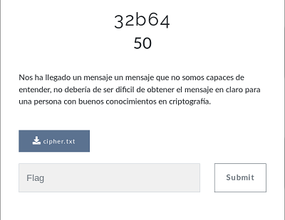

## Description
* **Name:** [32b64](https://ctf.interferencias.tech/challenges#32b64)
* **Points:** 50
* **Tag:** Crypto

<p align="center">

</p>

## Tools
* Firefox Version 60.7.0 https://www.mozilla.org/en-US/firefox/60.7.0/releasenotes/
* base64 (GNU coreutils) 8.30 https://manpages.debian.org/stretch/coreutils/base64.1.en.html

## Writeup
```bash
root@1v4n:~/CTF/JASYPCTF2019/crypto/32b64_GRANTED# file cipher.txt
cipher.txt: ASCII text, with very long lines
root@1v4n:~/CTF/JASYPCTF2019/crypto/32b64_GRANTED# md5sum cipher.txt
f953668ed88f5954effb20bf6c19484a  cipher.txt
root@1v4n:~/CTF/JASYPCTF2019/crypto/32b64_GRANTED# cat cipher.txt
Vm0wd2QyUXlVWGxWV0d4V1YwZDRWMVl3WkRSV01WbDNXa1JTVjAxV2JETlhhMUpUVmpBeFYySkVUbGhoTVVwVVZtcEJlRll5U2tWVWJHaG9UVlZ3VlZadGNFSmxSbGw1VTJ0V1ZXSkhhRzlVVmxaM1ZsWmFkR05GU214U2JHdzFWVEowVjFaWFNraGhSemxWVm14YU0xWnNXbUZrUjA1R1UyMTRVMkpIZHpGV1ZFb3dWakZhV0ZOcmFHaFNlbXhXVm0xNFlVMHhXbk5YYlVaclVqQTFSMVV5TVRSVk1rcElaSHBHVjFaRmIzZFdha1po
...
VlZkemVGWXhaSFZWYXpWWFVtdHdXRlpHV2xabFJUVkhWMnRvVDFack5WaFVWM1JYVGxaYVdHVklUbGhpVlhCYVdWVmtiMVl5UlhoalNIQmFUVzVvY2xwRldrdGtSMDVIVkcxc1UySnJSWGxXYlRFMFlUQTFTRkpZYUdGU1YxSlpXVzF6TVdOV1ZuTmFSemxZVW14S1dWa3dWbXRXUmtwMFpVWmFWbFp0YUhaV1ZFWmhZMjFPU1dKR2NGZFdia0Y2Vm10a05GTXlVbGRTYmxKUVZtMVNUMVp0TlVOaU1WcFpZMFZrYUUxVmJEUldNalZYVmxkS1dHRkdVbHBoTVhBelZqRmFZVkl4Vm5KYVJsSnBWbXh3TmxacVNqUldNVlowVTJ4YVdHSkhhR0ZaYTFwM1lVWlplRmR0Um10U01VcEpWREZrYjFSc1dsbFJXR1JYWWtkU05sUnNXbHBsVms1elZteEtWMUpWY0c5V2JURTBaREpHUjJORldsZFhSMmhZVm0xMFlXVldVWGhYYXpsb1ZtdHNObGRVVG10V01rcFpVV3QwVlZac2NGTmFWbHBMWkZaU2MxVnRiR2xTV0VJeVZteGpkMlZIU1hoaVJtUnBVbXhhVkZsdE1WTlhWbFowWlVWMGJGWnNiRFZhVldRd1lVZEdObEpzY0ZaV00xSnlWakJrUm1WR1dsVlNiSEJYVmpGS1dWZFVTalJoTWs1elkwVmtZVkpyTlhCVmJUVkRWbFpaZVdSR1RsTk5WVlkwVm0wMVQxVnRTa2RYYXpsV1lURktRMVF4UlRsUVVUMDk=
root@1v4n:~/CTF/JASYPCTF2019/crypto/32b64_GRANTED# nano get_flag.sh

#!/bin/bash

cat cipher.txt | base64 -d | base64 -d | base64 -d | base64 -d | base64 -d | base64 -d | base64 -d | base64 -d | base64 -d | base64 -d | base64 -d | base64 -d | base64 -d | base64 -d | base64 -d | base64 -d | base64 -d | base64 -d | base64 -d | base64 -d | base64 -d | base64 -d | base64 -d | base64 -d | base64 -d | base64 -d | base64 -d | base64 -d | base64 -d | base64 -d | base64 -d | base64 -d


root@1v4n:~/CTF/JASYPCTF2019/crypto/32b64# chmod +x get_flag.sh
root@1v4n:~/CTF/JASYPCTF2019/crypto/32b64_GRANTED# ./get_flag.sh
JASYP{F406C91200AB38522CC65F32F329F283}
```

<p align="center">

</p>

```

### Flag

`JASYP{F406C91200AB38522CC65F32F329F283}`
