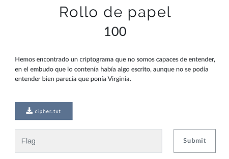

## Description
* **Name:** [Rollo de papel](https://ctf.interferencias.tech/challenges#Rollo%20de%20papel)
* **Points:** 100
* **Tag:** Crypto

<p align="center">

</p>

## Tools
* Firefox Version 60.7.0 https://www.mozilla.org/en-US/firefox/60.7.0/releasenotes/
* Python Cryptoanalisys https://github.com/jameslyons/python_cryptanalysis
* CyberChef https://gchq.github.io/CyberChef/

## Writeup
Download the file called cipher.txt (eefdcbdad48ebcd70ca1bc3ebd932a53) through the link in the lower left of the screen where we find a [Vigenere](http://rumkin.com/tools/cipher/vigenere.php) encrypted text with unknown key
```bash
root@1v4n:~/CTF/JASYPCTF2019/crypto/rollo_de_papel# file cipher.txt
cipher.txt: ASCII text
root@1v4n:~/CTF/JASYPCTF2019/crypto/rollo_de_papel# cat cipher.txt
khukh jkf pvv ibvvhukh fqufgkhtvv wud pbhxh inhj rhuc xxg wrfhlu hfgyfcyru bq rvtwpwq tdu h oqz stppgyru wxgzwqz gg lvvl fvm. mczbr{25m6dd2l71f3fke297h8h20e9336e90j}
root@1v4n:~/CTF/JASYPCTF2019/crypto/rollo_de_papel# md5sum cipher.txt
eefdcbdad48ebcd70ca1bc3ebd932a53  cipher.txt
root@1v4n:~/CTF/JASYPCTF2019/crypto/rollo_de_papel# git clone https://github.com/jameslyons/python_cryptanalysis.git
Clonando en 'python_cryptanalysis'...
remote: Enumerating objects: 76, done.
remote: Total 76 (delta 0), reused 0 (delta 0), pack-reused 76
Desempaquetando objetos: 100% (76/76), listo.
root@1v4n:~/CTF/JASYPCTF2019/crypto/rollo_de_papel# cd python_cryptanalysis/
root@1v4n:~/CTF/JASYPCTF2019/crypto/rollo_de_papel/python_cryptanalysis# nano break_vigenere.py
```
We proceed to perform a cryptanalysis to be able to break our encryption
```python
from ngram_score import ngram_score
from pycipher import Vigenere
import re
from itertools import permutations

qgram = ngram_score('quadgrams.txt')
trigram = ngram_score('trigrams.txt')
ctext = 'khukh jkf pvv ibvvhukh fqufgkhtvv wud pbhxh inhj rhuc xxg wrfhlu hfgyfcyru bq rvtwpwq tdu h oqz stppgyru wxgzwqz gg lvvl fvm. mczbr{25m6dd2l71f3fke297h8h20e9336e90j}'
ctext = re.sub(r'[^A-Z]','',ctext.upper())

# keep a list of the N best things we have seen, discard anything else
class nbest(object):
    def __init__(self,N=1000):
        self.store = []
        self.N = N

    def add(self,item):
        self.store.append(item)
        self.store.sort(reverse=True)
        self.store = self.store[:self.N]

    def __getitem__(self,k):
        return self.store[k]

    def __len__(self):
        return len(self.store)

#init
N=100
for KLEN in range(3,20):
    rec = nbest(N)

    for i in permutations('ABCDEFGHIJKLMNOPQRSTUVWXYZ',3):
        key = ''.join(i) + 'A'*(KLEN-len(i))
        pt = Vigenere(key).decipher(ctext)
        score = 0
        for j in range(0,len(ctext),KLEN):
            score += trigram.score(pt[j:j+3])
        rec.add((score,''.join(i),pt[:30]))

    next_rec = nbest(N)
    for i in range(0,KLEN-3):
        for k in xrange(N):
            for c in 'ABCDEFGHIJKLMNOPQRSTUVWXYZ':
                key = rec[k][1] + c
                fullkey = key + 'A'*(KLEN-len(key))
                pt = Vigenere(fullkey).decipher(ctext)
                score = 0
                for j in range(0,len(ctext),KLEN):
                    score += qgram.score(pt[j:j+len(key)])
                next_rec.add((score,key,pt[:30]))
        rec = next_rec
        next_rec = nbest(N)
    bestkey = rec[0][1]
    pt = Vigenere(bestkey).decipher(ctext)
    bestscore = qgram.score(pt)
    for i in range(N):
        pt = Vigenere(rec[i][1]).decipher(ctext)
        score = qgram.score(pt)
        if score > bestscore:
            bestkey = rec[i][1]
            bestscore = score       
    print bestscore,'Vigenere, klen',KLEN,':"'+bestkey+'",',Vigenere(bestkey).decipher(ctext)
```
The key is "HDC"
````bash
root@1v4n:~/CTF/JASYPCTF2019/crypto/rollo_GRANTED/python_cryptanalysis# python break_vigenere.py
-643.690742183 Vigenere, klen 3 :"HDC", DESDEHDCNOSGUSTARIACONCEDEROSUNANUEVAFLAGPARAQUEPODAISACERCAROSUNPOQUITOMASALOSPRIMEROSPUESTOSDEESTECTFJASYPFABECDDBFABCC
... XENRTWHYWHIFUCHURDORDRYNWUQOCIHAIITKEBUTWOABOKUZDDSEEBTSDRMOLONICESMDBJNMKGULJGEGMINKERPESMTJGSTIOCXSSFTOMYKTPQIYMWREALQW
-643.690742183 Vigenere, klen 6 :"HDCHDC", DESDEHDCNOSGUSTARIACONCEDEROSUNANUEVAFLAGPARAQUEPODAISACERCAROSUNPOQUITOMASALOSPRIMEROSPUESTOSDEESTECTFJASYPFABECDDBFABCC
... VETRNSHNASUPHESPFHGMWDCOVESCBFRLAYGENRKPUOGBIGUOHOEORDENRVEJEARJBOUACYTYEATOUZWAEMONEAREIDYDWIDOWSUSLEJUNWAYSMATQCJLNQBMU
-643.690742183 Vigenere, klen 9 :"HDCHDCHDC", DESDEHDCNOSGUSTARIACONCEDEROSUNANUEVAFLAGPARAQUEPODAISACERCAROSUNPOQUITOMASALOSPRIMEROSPUESTOSDEESTECTFJASYPFABECDDBFABCC
...
```
[And we go to decode it >](https://gchq.github.io/CyberChef/#recipe=Vigen%C3%A8re_Decode('hdc')&input=a2h1a2ggamtmIHB2diBpYnZ2aHVraCBmcXVmZ2todHZ2IHd1ZCBwYmh4aCBpbmhqIHJodWMgeHhnIHdyZmhsdSBoZmd5ZmN5cnUgYnEgcnZ0d3B3cSB0ZHUgaCBvcXogc3RwcGd5cnUgd3hnendxeiBnZyBsdnZsIGZ2bS4gbWN6YnJ7MjVtNmRkMmw3MWYzZmtlMjk3aDhoMjBlOTMzNmU5MGp9)

<p align="center">

</p>

### Flag

`JASYP{25F6AB2E71C3DDB297F8A20B9336C90C}`
