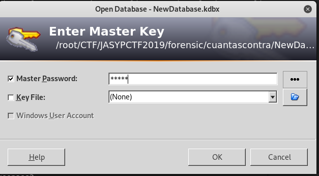
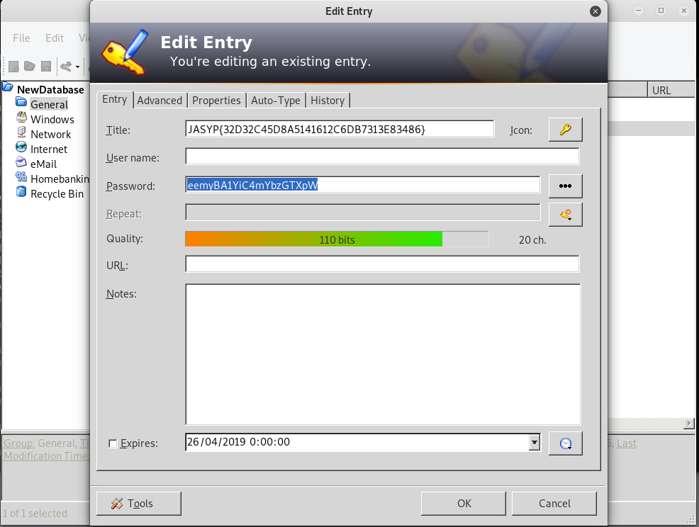

## Description
* **Name:** [Cuantas contraseñas](https://ctf.interferencias.tech/challenges#Cuantas%20contrase%C3%B1as)
* **Points:** 100
* **Tag:** Forensics

<p align="center">

</p>

## Tools
* Firefox Version 60.7.0 https://www.mozilla.org/en-US/firefox/60.7.0/releasenotes/
* John the Ripper 1.9.0-jumbo-1 http://www.openwall.com/john/
* keepass2 2.41 https://pkg.kali.org/pkg/keepass2

## Writeup
We downloaded through the link in the bottom left of the screen the file called NewDatabase.kdbx (411d3c16328957a8d107da30392fcd4a) and we made a preliminary analysis:

```bash
root@1v4n:~/CTF/JASYPCTF2019/forensic/cuantascontra# file NewDatabase.kdbx
NewDatabase.kdbx: Keepass password database 2.x KDBX
root@1v4n:~/CTF/JASYPCTF2019/forensic/cuantascontra# md5sum NewDatabase.kdbx
411d3c16328957a8d107da30392fcd4a  NewDatabase.kdbx
root@1v4n:~/CTF/JASYPCTF2019/forensic/cuantascontra# keepass2 NewDatabase.kdbx
```
We cracked the password with [JtR](http://www.openwall.com/john/) to open the password [Keepass password database](https://keepass.info/).

<p align="center">

</p>

```bash
keepass2john NewDatabase.kdbx > Crack.hash && john -format=keepass Crack.hash > output && john --show Crack.hash  > output && cat output
NewDatabase:admin
1 password hash cracked, 0 left
```
<p align="center">

</p>

```bash
JASYP{32d32c45d8a5141612c6db7313e83486}

Encontró : Hola caracola
(hash = 32d32c45d8a5141612c6db7313e83486)
```
<p align="center">

</p>

### Flag

`JASYP{32d32c45d8a5141612c6db7313e83486}`
