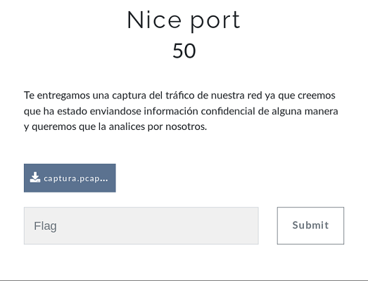

## Description
* **Name:** [Nice port](https://ctf.interferencias.tech/challenges#Nice%20port)
* **Points:** 50
* **Tag:** Forensics

<p align="center">

</p>

## Tools
* Firefox Version 60.7.0 https://www.mozilla.org/en-US/firefox/60.7.0/releasenotes/
* TShark (Wireshark) 2.6.8 https://www.wireshark.org/docs/relnotes/wireshark-2.6.8.html
* GNU strings 2.31.1

## Writeup
```bash
root@1v4n:~/CTF/JASYPCTF2019/forensic/nice_port_GRANTED# file captura.pcapng
captura.pcapng: pcap-ng capture file - version 1.0
root@1v4n:~/CTF/JASYPCTF2019/forensic/nice_port_GRANTED# md5sum captura.pcapng
be5daa1532ce8418635b20541c11bf80  captura.pcapng
root@1v4n:~/CTF/JASYPCTF2019/forensic/nice_port_GRANTED# tshark -r captura.pcapng -Y "ftp"
Running as user "root" and group "root". This could be dangerous.
 2309 21.140095784 199.71.215.197 → 192.168.1.33 FTP 96  Response: 220 Wing FTP Server ready...
 3077 24.546793311 192.168.1.33 → 199.71.215.197 FTP 82 demo-user Request: USER demo-user
 3105 24.736203348 199.71.215.197 → 192.168.1.33 FTP 103  Response: 331 Password required for demo-user
 3173 27.107941422 192.168.1.33 → 199.71.215.197 FTP 82 demo-user Request: PASS demo-user
 3175 27.545405998 199.71.215.197 → 192.168.1.33 FTP 97  Response: 230 User demo-user logged in.
 3177 27.545652559 192.168.1.33 → 199.71.215.197 FTP 72  Request: SYST
 3178 27.852826009 199.71.215.197 → 192.168.1.33 FTP 85  Response: 215 UNIX Type: L8
 3718 50.490116617 192.168.1.33 → 199.71.215.197 FTP 74 I Request: TYPE I
 3720 50.687739610 199.71.215.197 → 192.168.1.33 FTP 85  Response: 200 Type set to I
 3722 50.687909035 192.168.1.33 → 199.71.215.197 FTP 93 192,168,1,33,216,115 Request: PORT 192,168,1,33,216,115
 3723 50.892590291 199.71.215.197 → 192.168.1.33 FTP 95  Response: 200 Port command successful
 3724 50.892768154 192.168.1.33 → 199.71.215.197 FTP 112 JASYP{F1371C9F63030414AB5F6BA2E766AC80} Request: STOR JASYP{F1371C9F63030414AB5F6BA2E766AC80}
 3725 51.199866107 199.71.215.197 → 192.168.1.33 FTP 99  Response: 550 Cannot STOR. No permission.
root@1v4n:~/CTF/JASYPCTF2019/forensic/nice_port_GRANTED# nano get_flag.sh

#! /bin/bash

tshark -r captura.pcapng -Y "ftp" | awk '{print $8}' | grep "JASYP{.*"

root@1v4n:~/CTF/JASYPCTF2019/forensic/nice_port_GRANTED# chmod +x get_flag.sh
root@1v4n:~/CTF/JASYPCTF2019/forensic/nice_port_GRANTED# ./get_flag.sh
JASYP{F1371C9F63030414AB5F6BA2E766AC80}
```

<p align="center">

</p>

or more simple ;)

```bash
root@1v4n:~/CTF/JASYPCTF2019/forensic/nice_port_GRANTED# nano get_flag_2.sh

#! /bin/bash

strings captura.pcapng | grep "JASYP{.*" | awk '{print $2}'

root@1v4n:~/CTF/JASYPCTF2019/forensic/nice_port_GRANTED# chmod +x get_flag_2.sh
root@1v4n:~/CTF/JASYPCTF2019/forensic/nice_port_GRANTED# ./get_flag_2.sh
JASYP{F1371C9F63030414AB5F6BA2E766AC80}
```

### Flag

`JASYP{F1371C9F63030414AB5F6BA2E766AC80}`
