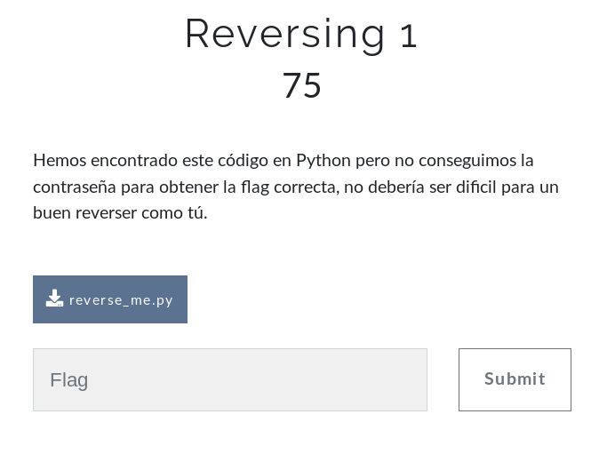

## Description
* **Name:** [Reversing 1](https://ctf.interferencias.tech/challenges#Reversing%201)
* **Points:** 75
* **Tag:** Reversing

<p align="center">

</p>

## Tools
* Firefox Version 60.7.0 https://www.mozilla.org/en-US/firefox/60.7.0/releasenotes/
* Python https://www.python.org/downloads/release/python-2716/

## Writeup
Descargamos a través del link en la parte inferior izquierda de la pantalla el archivo llamado reverse_me.py (4226de9b85ad25cf7957d7cd06c92eb9) y pasamos a realizar un análisis preliminar:

```bash
root@1v4n:~/CTF/JASYPCTF2019/reversing/reversing1# file reverse_me.py
reverse_me.py: Python script, ASCII text executable
root@1v4n:~/CTF/JASYPCTF2019/reversing/reversing1# md5sum reverse_me.py
4226de9b85ad25cf7957d7cd06c92eb9  reverse_me.py
```
Examinamos el script de Python
root@1v4n:~/CTF/JASYPCTF2019/reversing/reversing1# nano reverse_me.py
```python
#!/usr/bin/env python

import sys
import base64

print3 = str(sys.argv[1])
print5 = "3033324534443730453344304237367d"
print1 = "4a415359507b43453646333639463543304635364333"
print2 = "Password incorrecta"
print10 = "qwerty"

def a():
        d = 3
        if len(print3)%d==2:
                return base64.b64decode(print3[::-1])

def b():
        d = 3
        e = 5
        if len(print3)%d!=0:
                return (len(print3)%e)*12


print1 = print1+str(b())

print6 = print1+print5

print4 = print6.decode("hex")

if a() == print10:
        print(print4)
else:
        print(print2)
```
Nuestro script necesita que le aportemos un string con lo que probamos su funcionamiento, donde observamos que si no se cumplen las condiciones nos arroja print(print2) > Password incorrecta
```bash
root@1v4n:~/CTF/JASYPCTF2019/reversing/reversing1# python reverse_me.py AAAA
Password incorrecta
```
Leyendo el código podemos saltarnos la validación del script a través del siguiente exploit (get_flag.py):
```python
#!/usr/bin/env python

import sys
import base64

print1 = "4a415359507b43453646333639463543304635364333"
print5 = "3033324534443730453344304237367d"
print6 = print1+print5
print4 = print6.decode("hex")
print(print4)

root@1v4n:~/CTF/JASYPCTF2019/reversing/reversing1# python get_flag.py
JASYP{CE6F369F5C0F56C3032E4D70E3D0B76}
```

### Flag

`JASYP{CE6F369F5C0F56C3032E4D70E3D0B76}`
