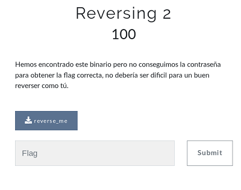

## Description
* **Name:** [Reversing 2](https://ctf.interferencias.tech/challenges#Reversing%202)
* **Points:** 100
* **Tag:** Reversing

<p align="center">

</p>

## Tools
* Firefox Version 60.7.0 https://www.mozilla.org/en-US/firefox/60.7.0/releasenotes/
* GNU strings 2.31.1

## Writeup
Descargamos a través del link en la parte inferior izquierda de la pantalla el archivo llamado reverse_me.py (4226de9b85ad25cf7957d7cd06c92eb9) y pasamos a realizar un análisis preliminar:

```bash
root@1v4n:~/CTF/JASYPCTF2019/reversing/reversing2# file reverse_me
reverse_me: ELF 64-bit LSB pie executable, x86-64, version 1 (SYSV), dynamically linked, interpreter /lib64/ld-linux-x86-64.so.2, for GNU/Linux 3.2.0, BuildID[sha1]=29f6f329c02657bb25553a15bd6d277bf561f789, not stripped
root@1v4n:~/CTF/JASYPCTF2019/reversing/reversing2# md5sum reverse_me
230d11cd8fd5839b77f8e33943afb006  reverse_me
```
Examinamos con strings el ejecutable ELF

```strings reverse_me | less
...
bash
/lib64/ld-linux-x86-64.so.2
libc.so.6
strcpy
puts
__cxa_finalize
strcmp
__libc_start_main
_ITM_deregisterTMCloneTable
__gmon_start__
_Jv_RegisterClasses
_ITM_registerTMCloneTable
GLIBC_2.2.5
=i       
=J       
asdfgh
JASYf
4DE8
4EE104A3H
8FBA37AFH
0F108B26H
AWAVI
AUATL
[]A\A]A^A_
Password incorrecta
;*3$"
GCC: (Debian 6.3.0-18+deb9u1) 6.3.0 20170516
...
root@1v4n:~/CTF/JASYPCTF2019/reversing/reversing2# ./reverse_me AAAA
Password incorrecta
```
Nuestro ejecutable ELF necesita de un string. Observamos en el anterior examen que 'asdfgh' puede ser un posible candidato para reverlarnos la bandera

```bash
root@1v4n:~/CTF/JASYPCTF2019/reversing/reversing2# chmod +x reverse_me
root@1v4n:~/CTF/JASYPCTF2019/reversing/reversing2# ./reverse_me asdfgh
JASYP{4DE84EE104A39258FBA37AF0F108B268}
```
Por lo tanto nuestro solver sería

```bash
root@1v4n:~/CTF/JASYPCTF2019/reversing/reversing2# nano get_flag.sh
#! /bin/bash

./reverse_me asdfgh > flag.txt
root@1v4n:~/CTF/JASYPCTF2019/reversing/reversing2# ./get_flag.sh
root@1v4n:~/CTF/JASYPCTF2019/reversing/reversing2# cat flag.txt
JASYP{4DE84EE104A39258FBA37AF0F108B268}
```
<p align="center">

</p>

### Flag

`JASYP{4DE84EE104A39258FBA37AF0F108B268}`
