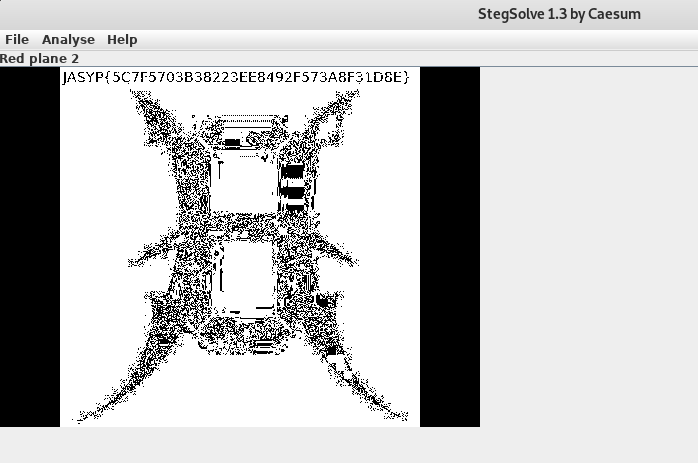

## Description
* **Name:** [Nada más que ver](https://ctf.interferencias.tech/challenges#Nada%20m%C3%A1s%20que%20ver)
* **Tag:** Stego

## Tools
* Firefox Version 60.7.0 https://www.mozilla.org/en-US/firefox/60.7.0/releasenotes/
* StegSolve http://www.caesum.com/handbook/Stegsolve.jar // https://github.com/zardus/ctf-tools/blob/master/stegsolve/install

## Writeup
```bash
root@1v4n:~/CTF/JASYPCTF2019/stego/nada_GRANTED# file hdc.jpg
hdc.jpg: JPEG image data, JFIF standard 1.01, resolution (DPI), density 72x72, segment length 16, Exif Standard: [TIFF image data, little-endian, direntries=5, xresolution=74, yresolution=82, resolutionunit=2, software=GIMP 2.8.22], progressive, precision 8, 480x360, components 3
root@1v4n:~/CTF/JASYPCTF2019/stego/nada_GRANTED# exiftool hdc.jpg
ExifTool Version Number         : 11.56
File Name                       : hdc.jpg
Directory                       : .
File Size                       : 50 kB
File Modification Date/Time     : 2019:04:16 19:36:59+02:00
File Access Date/Time           : 
File Inode Change Date/Time     : 2019:04:26 22:26:15+02:00
File Permissions                : rw-r--r--
File Type                       : JPEG
File Type Extension             : jpg
MIME Type                       : image/jpeg
JFIF Version                    : 1.01
Exif Byte Order                 : Little-endian (Intel, II)
X Resolution                    : 72
Y Resolution                    : 72
Resolution Unit                 : inches
Software                        : GIMP 2.8.22
Exif Version                    : 0220
Flashpix Version                : 0100
Color Space                     : Uncalibrated
Exif Image Width                : 480
Exif Image Height               : 360
Flash Pix Version               : FlashPix Version 1.0
Image Width                     : 480
Image Height                    : 360
Encoding Process                : Progressive DCT, Huffman coding
Bits Per Sample                 : 8
Color Components                : 3
Y Cb Cr Sub Sampling            : YCbCr4:4:4 (1 1)
Image Size                      : 480x360
Megapixels                      : 0.173
root@1v4n:~/CTF/JASYPCTF2019/stego/nada_GRANTED# steghide info hdc.jpg
"hdc.jpg":
  formato: jpeg
  capacidad: 2,4 KB
�Intenta informarse sobre los datos adjuntos? (s/n) s
Anotar salvoconducto:
steghide: �no pude extraer ning�n dato con ese salvoconducto!
root@1v4n:~/CTF/JASYPCTF2019/stego/nada_GRANTED# stegcracker hdc.jpg
StegCracker 2.0.7 - (https://github.com/Paradoxis/StegCracker)
Copyright (c) 2019 - Luke Paris (Paradoxis)

Counting lines in wordlist..
Attacking file 'hdc.jpg' with wordlist '/usr/share/wordlists/rockyou.txt'..
...
```
False positive of steganography LSB. We observe with StegSolve the flag in Red Plane 2

```
root@1v4n:~/Stego/bin# wget http://www.caesum.com/handbook/Stegsolve.jar -O stegsolve.jar
  http://www.caesum.com/handbook/Stegsolve.jar
Resolviendo www.caesum.com (www.caesum.com)... 216.234.173.1
Conectando con www.caesum.com (www.caesum.com)[216.234.173.1]:80... conectado.
Petición HTTP enviada, esperando respuesta... 200 OK
Longitud: 312271 (305K) [application/x-java-archive]
Grabando a: “stegsolve.jar”

stegsolve.jar       100%[===================>] 304,95K   169KB/s    en 1,8s    

(169 KB/s) - “stegsolve.jar” guardado [312271/312271]
root@1v4n:~/Stego/bin# chmod +x stegsolve.jar
root@1v4n:~/Stego/bin# java -jar stegsolve.jar
```
<p align="center">

</p>

### Flag

`JASYP{5C7F5703B38223EE8492F573A8F31D8E}`
