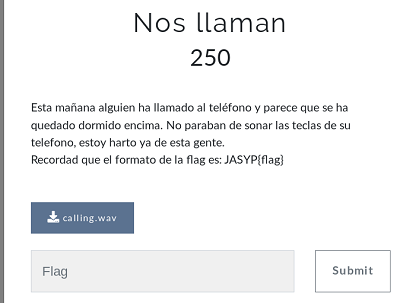
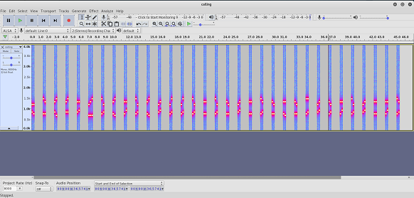
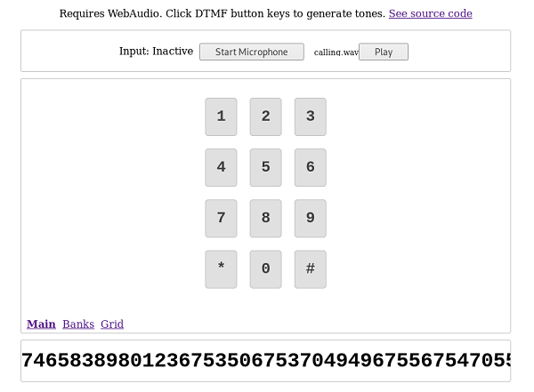
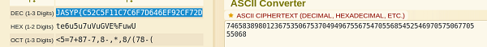
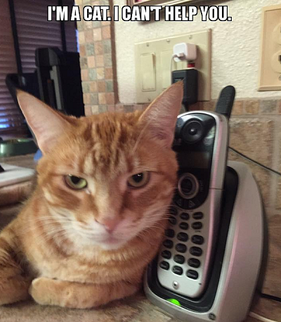

## Description
* **Name:** [Nos llaman](https://ctf.interferencias.tech/challenges#Nos%20llaman)
* **Points:** 100
* **Tag:** Stego

<p align="center">

</p>

## Tools
* Firefox Version 60.7.0 https://www.mozilla.org/en-US/firefox/60.7.0/releasenotes/
* Detect DTMF Tones http://dialabc.com/sound/detect/
* dtmf-detect https://unframework.github.io/dtmf-detect/

## Writeup
```bash
root@1v4n:~/CTF/JASYPCTF2019/stego/nosllaman# file calling.wav
calling.wav: RIFF (little-endian) data, WAVE audio, Microsoft PCM, 8 bit, mono 8000 Hz
root@1v4n:~/CTF/JASYPCTF2019/stego/nosllaman# md5sum calling.wav
4bd618885d1355065c6b647a9291c1a7  calling.wav
root@1v4n:~/CTF/JASYPCTF2019/stego/nosllaman# binwalk calling.wav

DECIMAL       HEXADECIMAL     DESCRIPTION
--------------------------------------------------------------------------------

root@1v4n:~/CTF/JASYPCTF2019/stego/nosllaman# steghide info calling.wav
"calling.wav":
  formato: wave audio, PCM encoding
  capacidad: 22,2 KB
�Intenta informarse sobre los datos adjuntos? (s/n) s
Anotar salvoconducto:
steghide: �no pude extraer ning�n dato con ese salvoconducto!
```
False positive of steganography LSB. We observe with audacity through its spetrogram [DMTF](https://en.wikipedia.org/wiki/Dual-tone_multi-frequency_signaling) tones

```bash
root@1v4n:~/CTF/JASYPCTF2019/stego/nosllaman# audacity calling.wav
```
<p align="center">

</p>

We visited the online tool https://unframework.github.io/dtmf-detect/ and played the calling.wav file

<p align="center">

</p>

We get an ASCII code 7465838980123675350675370494967556754705568545254697057506770555068 that we decode
at https://www.dcode.fr/ascii-code

<p align="center">

</p>

### Flag

`JASYP{C52C5F11C7C6F7D646EF92CF72D}`

<p align="center">

</p>
