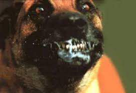
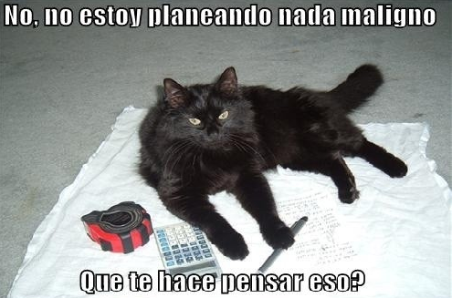

## Description
* **Name:** [Perro Maligno](https://ctf.interferencias.tech/challenges#Perro%20maligno)
* **Points:** 150
* **Tag:** Stego

<p align="center">

</p>

## Tools
* Firefox Version 60.7.0 https://www.mozilla.org/en-US/firefox/60.7.0/releasenotes/
* StegCracker 2.0.7 https://github.com/Paradoxis/StegCracker

## Writeup
```root@1v4n:~/CTF/JASYPCTF2019/stego/perro_granted# stegcracker -V
StegCracker 2.0.7 - (https://github.com/Paradoxis/StegCracker)
Copyright (c) 2019 - Luke Paris (Paradoxis)

usage: stegcracker <file> [<wordlist>]
stegcracker: error: the following arguments are required: file
root@1v4n:~/CTF/JASYPCTF2019/stego/perro_granted# file perro_maligno.jpg
perro_maligno.jpg: JPEG image data, JFIF standard 1.01, aspect ratio, density 1x1, segment length 16, baseline, precision 8, 271x186, components 3
root@1v4n:~/CTF/JASYPCTF2019/stego/perro_granted# exiftool perro_maligno.jpg
ExifTool Version Number         : 11.16
File Name                       : perro_maligno.jpg
Directory                       : .
File Size                       : 5.6 kB
File Modification Date/Time     : 2019:04:15 20:17:35+02:00
File Access Date/Time           : 2019:07:16 19:16:52+02:00
File Inode Change Date/Time     : 2019:04:26 21:25:37+02:00
File Permissions                : rw-r--r--
File Type                       : JPEG
File Type Extension             : jpg
MIME Type                       : image/jpeg
JFIF Version                    : 1.01
Resolution Unit                 : None
X Resolution                    : 1
Y Resolution                    : 1
Image Width                     : 271
Image Height                    : 186
Encoding Process                : Baseline DCT, Huffman coding
Bits Per Sample                 : 8
Color Components                : 3
Y Cb Cr Sub Sampling            : YCbCr4:2:0 (2 2)
Image Size                      : 271x186
Megapixels                      : 0.050
root@1v4n:~/CTF/JASYPCTF2019/stego/perro_granted# strings perro_maligno.jpg
JFIF
!1!%)+...
383-7(-.+
 +--+-----------+-----------------+------+----7-+--
$3br
%&'()*456789:CDEFGHIJSTUVWXYZcdefghijstuvwxyz
	#3R
&'()*56789:CDEFGHIJSTUVWXYZcdefghijstuvwxyz
...
>*xz
L`*Us
.I(#?
<=j9
	,}1
]ov7E
root@1v4n:~/CTF/JASYPCTF2019/stego/perro_granted# steghide info perro_maligno.jpg
"perro_maligno.jpg":
  formato: jpeg
  capacidad: 294,0 Byte
�Intenta informarse sobre los datos adjuntos? (s/n) s
Anotar salvoconducto:
steghide: �no pude extraer ning�n dato con ese salvoconducto!
```

We detected a stego LSB file with password. But we do not know the password. We use brute force with Stegcracker

```bash
root@1v4n:~/CTF/JASYPCTF2019/stego/perro_granted# stegcracker perro_maligno.jpg /usr/share/wordlists/rockyou.txt
StegCracker 2.0.7 - (https://github.com/Paradoxis/StegCracker)
Copyright (c) 2019 - Luke Paris (Paradoxis)

Counting lines in wordlist..
Attacking file 'perro_maligno.jpg' with wordlist '/usr/share/wordlists/rockyou.txt'..
Successfully cracked file with password: maligno
Tried 68166 passwords
Your file has been written to: perro_maligno.jpg.out
maligno
root@1v4n:~/CTF/JASYPCTF2019/stego/perro_granted# file perro_maligno.jpg.out
perro_maligno.jpg.out: ASCII text
root@1v4n:~/CTF/JASYPCTF2019/stego/perro_granted# cat perro_maligno.jpg.out | grep "JASYP{.*"
JASYP{46D966D0AE391931D677CF79E270F276}
```
or with steghide and password "maligno"

```bash
root@1v4n:~/CTF/JASYPCTF2019/stego/perro_granted# steghide extract -sf perro_maligno.jpg
Anotar salvoconducto:
ya existe el archivo "secret.txt". �lo sobreescribo? (s/n) s
anot� los datos extra�dos e/"secret.txt".
root@1v4n:~/CTF/JASYPCTF2019/stego/perro_granted# cat secret.txt | grep "JASYP{.*"
JASYP{46D966D0AE391931D677CF79E270F276}
````
<p align="center">

</p>

### Flag

`JASYP{46D966D0AE391931D677CF79E270F276}`
