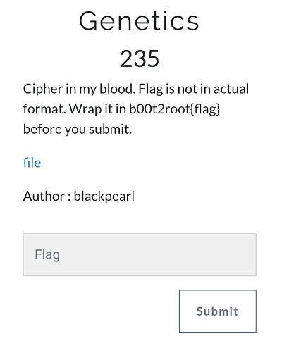

## Description
* **Name:**  Genetics
* **Author:** Blackpearl
* **Artifact:** http://[IP]/challenges#Genetics
* **Points:** 235
* **Tag:** Crypto

<p align="center">

</p>

## Tools
* Firefox Version 60.5.1 https://www.mozilla.org/en-US/firefox/60.5.1/releasenotes/
* DNA Based Steganography for Security Marking http://www.polestarltd.com/ttg/isspeeches/051403/
* DNA Codes https://github.com/JohnHammond/ctf-katana/blob/master/img/dna_codes.png

## Writeup

We have a file called Biography.txt w/ next plaintext `ACCAGTAAAACGTTGAGACAGTTGAATATCAAACTACACCGAATTCATATGTCACAGCGGCCGACACAGATGATAACA` encoded in DNA codes. We observe four letters A (Adenine), C (Cytosine), G (Guanine) and T (Thymine) that are repeated in the message and represent the four main bases found in DNA. We investigated studies on steganography with DNA markers. We find http://www.polestarltd.com/ttg/isspeeches/051403/ and https://github.com/JohnHammond/ctf-katana/blob/master/img/dna_codes.png

<p align="center">

</p>

Python mapping of DNA codons

```python
mapping = {

		'AAA': 'a',
		'AAC': 'b',
		'AAG': 'c',
		'AAT': 'd',
		'ACA': 'e',
		'ACC': 'f',
		'ACG': 'g',
		'ACT': 'h',
		'AGA': 'i',
		'AGC': 'j',
		'AGG': 'k',
		'AGT': 'l',
		'ATA': 'm',
		'ATC': 'n',
		'ATG': 'o',
		'ATT': 'p',
		'CAA': 'q',
		'CAC': 'r',
		'CAG': 's',
		'CAT': 't',
		'CCA': 'u',
		'CCC': 'v',
		'CCG': 'w',
		'CCT': 'x',
		'CGA': 'y',
		'CGC': 'z',
		'CGG': 'A',
		'CGT': 'B',
		'CTA': 'C',
		'CTC': 'D',
		'CTG': 'E',
		'CTT': 'F',
		'GAA': 'G',
		'GAC': 'H',
		'GAG': 'I',
		'GAT': 'J',
		'GCA': 'K',
		'GCC': 'L',
		'GCG': 'M',
		'GCT': 'N',
		'GGA': 'O',
		'GGC': 'P',
		'GGG': 'Q',
		'GGT': 'R',
		'GTG': 'S',
		'GTC': 'T',
		'GTG': 'U',
		'GTT': 'V',
		'TAA': 'W',
		'TAC': 'X',
		'TAG': 'Y',
		'TAT': 'Z',
		'TTG': ' ',
		'TTC': '0',
		'TCA': '1',
		'TCC': '2',
		'TCG': '3',
		'TCT': '4',
		'TGA': '5',
		'TGC': '6',
		'TGG': '7',
		'TGT': '8',
		'TTA': '9'
}


def decode_dna( string ):

	pieces = []
	for i in range( 0, len(string), 3 ):
		piece =  string[i:i+3]
		# pieces.append()
		pieces.append( mapping[piece] )

	return "".join(pieces)


string = 'ACCAGTAAAACGTTGAGACAGTTGAATATCAAACTACACCGAATTCATATGTCACAGCGGCCGACACAGATGATAACA'
print decode_dna(strin
```
Run our script and here is the Flag

```bash
root@1v4n:~/CTF/b002root19/Crypto/Genetics_GRANTED# python dna_solver.py
flag is dnaCrypto1sAwesome
```

### Flag

`b00t2root{dnaCrypto1sAwesome}`
