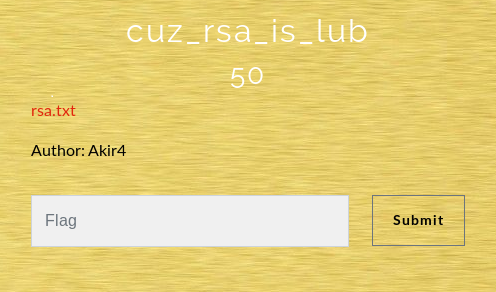

## Description
* **Name:**  cuz_rsa_is_lub
* **Author:** Akir4
* **Artifact:** [Link](https://drive.google.com/open?id=1IXFbLc09QnJ-97whl2o8HLfinHpLdvjQ)
* **Points:** 50
* **Tag:** Crypto

<p align="center">

</p>

## Tools
* Firefox Version 60.5.1 https://www.mozilla.org/en-US/firefox/60.5.1/releasenotes/
* gdown 3.7.4 https://pypi.org/project/gdown/
* RsaCtfTool https://github.com/Ganapati/RsaCtfTool

## Writeup

```bash
root@1v4n:~/CTF/b002root19/Crypto# mkdir cuz_rsa_is_lub
root@1v4n:~/CTF/b002root19/Crypto# cd cuz_rsa_is_lub
root@1v4n:~/CTF/b002root19/Crypto/cuz_rsa_is_lub# gdown https://drive.google.com/uc?id=1IXFbLc09QnJ-97whl2o8HLfinHpLdvjQ
Downloading...
From: https://drive.google.com/uc?id=1IXFbLc09QnJ-97whl2o8HLfinHpLdvjQ
To: /root/CTF/b002root19/Crypto/cuz_rsa_is_lub/rsa.txt
100%|█████████████████████████████████████████████████████████████████████████████████████████████████████████| 364/364 [00:00<00:00, 74.6kB/s]
root@1v4n:~/CTF/b002root19/Crypto/cuz_rsa_is_lub# ls -la
total 12
drwxr-xr-x 2 root root 4096
drwxr-xr-x 9 root root 4096
-rw-r--r-- 1 root root  364  rsa.txt
root@1v4n:~/CTF/b002root19/Crypto/cuz_rsa_is_lub# file rsa.txt
rsa.txt: ASCII text
root@1v4n:~/CTF/b002root19/Crypto/cuz_rsa_is_lub# cat rsa.txt
n= 71641831546926719303369645296528546480083425905458247405279061196214424558100678947996271179659761521775290973790597533683668081173314940392098256721488468660504161994357

e = 65537


c = 63127079832500412362950100242549738176318170072331491750802716138621322974529994914407846448954487685068331564008936808539420562251661435790855422130443584773306161128156


root@1v4n:~/CTF/b002root19/Crypto/cuz_rsa_is_lub# git clone https://github.com/Ganapati/RsaCtfTool.git
Clonando en 'RsaCtfTool'...
remote: Enumerating objects: 65, done.
remote: Counting objects: 100% (65/65), done.
remote: Compressing objects: 100% (34/34), done.
remote: Total 527 (delta 35), reused 58 (delta 31), pack-reused 462
Recibiendo objetos: 100% (527/527), 1.80 MiB | 1.00 MiB/s, listo.
Resolviendo deltas: 100% (276/276), listo.
root@1v4n:~/CTF/b002root19/Crypto/cuz_rsa_is_lub# python RsaCtfTool/RsaCtfTool.py -n 71641831546926719303369645296528546480083425905458247405279061196214424558100678947996271179659761521775290973790597533683668081173314940392098256721488468660504161994357 -e 65537 --uncipher 63127079832500412362950100242549738176318170072331491750802716138621322974529994914407846448954487685068331564008936808539420562251661435790855422130443584773306161128156
[+] Clear text : b00t2root{RSA_c4n_b3_vuln3r4bl3}
```

### Flag

`b00t2root{RSA_c4n_b3_vuln3r4bl3}`
