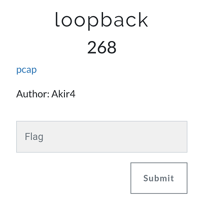
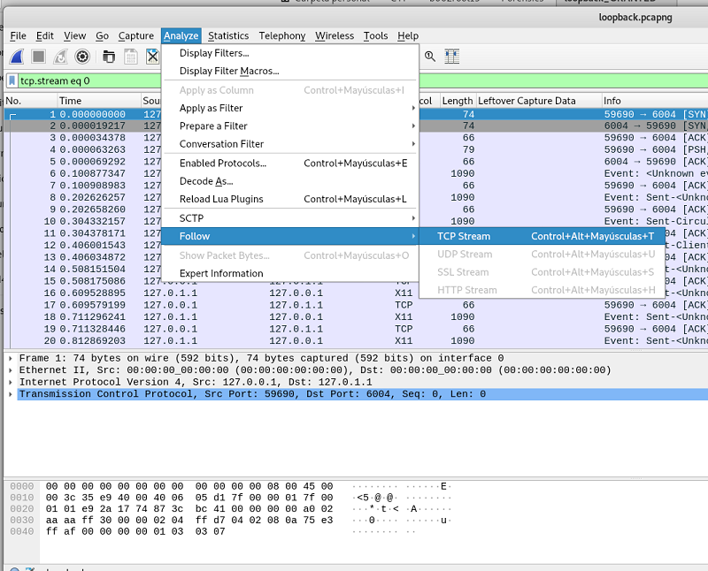
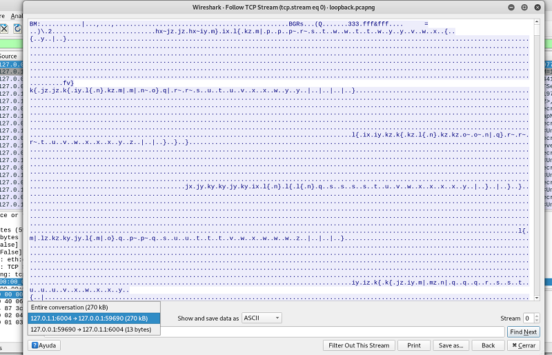
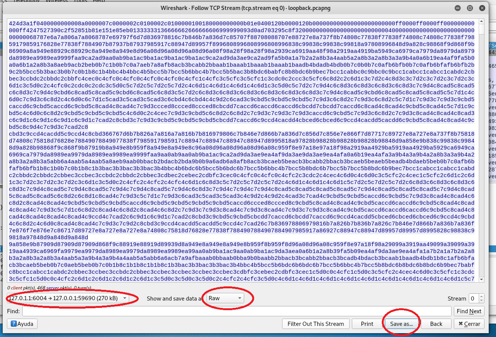
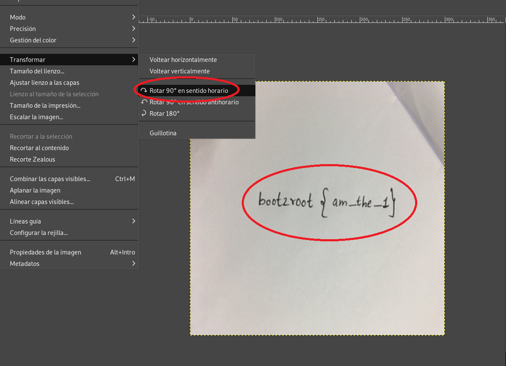

## Description
* **Name:**  loopback
* **Author:** Akir4
* **Artifact:** [Link](https://drive.google.com/open?id=id=1VeWCh2GK5RcAowBQLZECEwB5dAvvmInh
)
* **Points:** 268
* **Tag:** Forensics

<p align="center">

</p>

## Tools

* Firefox Version 60.5.1 https://www.mozilla.org/en-US/firefox/60.5.1/releasenotes/
* gdown 3.7.4 https://pypi.org/project/gdown/
* Wireshark 2.6.7 https://www.wireshark.org/docs/relnotes/wireshark-2.6.7.html
* Foremost 1.5.7 http://foremost.sourceforge.net/

## Writeup

```bash
root@1v4n:~/CTF/b002root19/Forensics/loopback# gdown https://drive.google.com/uc?id=1VeWCh2GK5RcAowBQLZECEwB5dAvvmInh
Downloading...
From: https://drive.google.com/uc?id=1VeWCh2GK5RcAowBQLZECEwB5dAvvmInh
To: /root/CTF/b002root19/Forensics/loopback/loopback.pcapng
100%|██████████████████████████████████████████████████████████████████████████████████████| 324k/324k [00:00<00:00, 1.81MB/s]

root@1v4n:~/CTF/b002root19/Forensics/loopback_GRANTED# file loopback.pcapng
loopback.pcapng: pcap-ng capture file - version 1.0

root@1v4n:~/CTF/b002root19/Forensics/loopback# wireshark loopback.pcapng
```
We need to reconstruct the binary data. Using Wireshark we select in the loopback.pcapng Analyze> Follow> TCP Stream>

<p align="center">

</p>

We apply visualization filter so that only the selected flow packets are shown from 127.0.1.1:6004> 127.0.0.1:59690

<p align="center">

</p>

We started to extract this data. Select the option Unformatted and Save as to export the binary data> loopback.raw "loopback.raw".

<p align="center">

</p>


```bash
root@1v4n:~/CTF/b002root19/Forensics/loopback_GRANTED# file loopback.raw
loopback.raw: PC bitmap, Windows 98/2000 and newer format, 300 x 300 x 24

Hint

root@1v4n:~/CTF/b002root19/Forensics/loopback# strings loopback.raw | grep "B00t2root{.*"
B00t2root{i_am_the_flag_format}

root@1v4n:~/CTF/b002root19/Forensics/loopback_GRANTED# foremost -v -i loopback.raw
Foremost version 1.5.7 by Jesse Kornblum, Kris Kendall, and Nick Mikus
Audit File

Foremost started at
Invocation: foremost -v -i loopback.raw
Output directory: /root/CTF/b002root19/Forensics/loopback/output
Configuration file: /etc/foremost.conf
Processing: loopback.raw
|------------------------------------------------------------------
File: loopback.raw

Length: 263 KB (270169 bytes)

Num      Name (bs=512)         Size      File Offset     Comment

0:      00000000.bmp         263 KB               0       (300 x 300)
*|
1 FILES EXTRACTED

bmp:= 1
------------------------------------------------------------------

Foremost finished at
root@1v4n:~/CTF/b002root19/Forensics/loopback/output/bmp# file 00000000.bmp
00000000.bmp: PC bitmap, Windows 98/2000 and newer format, 300 x 300 x 24

root@1v4n:~/CTF/b002root19/Forensics/loopback/output/bmp# gimp 00000000.bmp
```
<p align="center">

</p>

### Flag

`b00t2root{am_the_1}`
