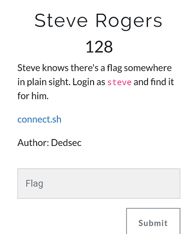

## Description
* **Name:**  Steve Rogers
* **Author:** Dedsec
* **Artifact:** http://[IP]/challenges#Steve%20Rogers
* **Points:** 128
* **Tag:** Linux

<p align="center">

</p>

## Tools

* Firefox Version 60.5.1 https://www.mozilla.org/en-US/firefox/60.5.1/releasenotes/
* ps("process status") https://manpages.debian.org/stretch/procps/ps.1.en.html

## Writeup

```bash
root@1v4n:~/CTF/b002root19/Linux/Steve_Rogers# cat connect.sh
#!/bin/bash

exec socat tcp-connect:18.217.123.244:2604 file:`tty`,raw,echo=0

root@1v4n:~/CTF/b002root19/Linux/Steve_Rogers# chmod +x connect.sh
root@1v4n:~/CTF/b002root19/Linux/Steve_Rogers# ./connect.sh
steve@c6416eb19afe:~$ ps -ef | grep bash | grep root
root         1     0  0 14:23 pts/0    00:00:00 bash /tmp/42.sh b00t2root{Cmd_l1n3_fl4g5_4r3_0bv10u5}
```

### Flag

`b00t2root{Cmd_l1n3_fl4g5_4r3_0bv10u5}`
