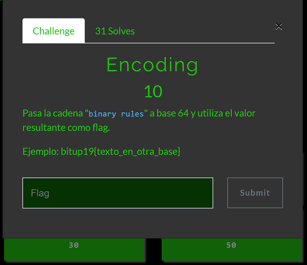

## Description
* **Name:** [Encoding](https://ctf.bitupalicante.com/challenges#Encoding)
* **Points:** 10
* **Tags:** Encoding, Atomic

<p align="center">

</p>

## Tools
* Firefox 68.2.0esr https://www.mozilla.org/en-US/firefox/68.2.0/releasenotes/
* Python 3 https://www.python.org/download/releases/3.0/

## Writeup

```python
#!/usr/bin/python3

try:
    import base64
except ImportError:
    print("Error importing 'base64'")
    exit()

try:
    import hashlib
except ImportError:
    print("Error importing 'hashlib'")
    exit()

print("Bitup 2019 CTF #Atomic Write-Up")
print("Write-up Interactivo x 1v4n\n")
print("The challenge Encoding says:")
print("""Pass the string "binary rules" to base64
and use the resulting value as the flag.
Example: bitup19{text_in_other_base}. [Enter]: """)
f = input(" ")
print("We encode the string binary rules in base64. [Enter]: ")
f = input(" ")
encoding="binary rules"
m = base64.b64encode(encoding.encode("utf-8"))
print("\nThe result_function_encoding is: {}".format(str(m, "utf-8")))
exit()
```

### Flag

`bitup19{YmluYXJ5IHJ1bGVz}`

<p align="center">

</p>
