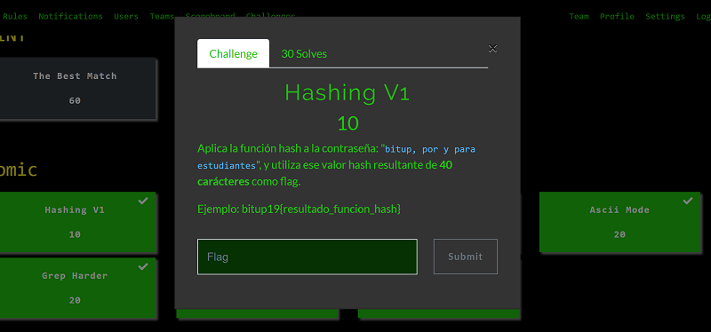
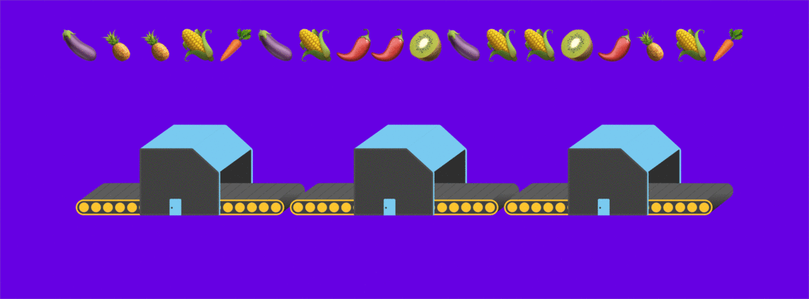

## Description
* **Name:** [Hashing V1](https://ctf.bitupalicante.com/challenges#Hashing%20V1)
* **Points:** 10
* **Tags:** Hashing, Atomic

<p align="center">

</p>

## Tools
* Firefox 68.2.0esr https://www.mozilla.org/en-US/firefox/68.2.0/releasenotes/
* Python 3 https://www.python.org/download/releases/3.0/

## Writeup

```python
#!/usr/bin/python3

try:
    import hashlib
except ImportError:
    print("Error importing 'hashlib'")
    exit()

print("Bitup 2019 CTF #Atomic Write-Up")
print("Write-up Interactivo x 1v4n\n")
print("The challenge Hashing V1 says:")
print("""Apply the hash function to the
"bitup, por y para estudiantes" password, and use
that resulting hash value of 40 characters as a flag.
Example: bitup19{result_function_hash}. [Enter]: """)
f = input(" ")
print("We encode the string bitup, por y para estudiantes in SHA1. [Enter]: ")
f = input(" ")
hashingv1="bitup, por y para estudiantes"
m = hashlib.sha1()
m.update(hashingv1.encode('utf-8'))
print("\nThe result_function_hash is: {}".format(m.hexdigest()))
exit()
```
### Flag

`bitup19{4b73227876a85c38f875b12ffdb1deb375c98666}`

<p align="center">

</p>
