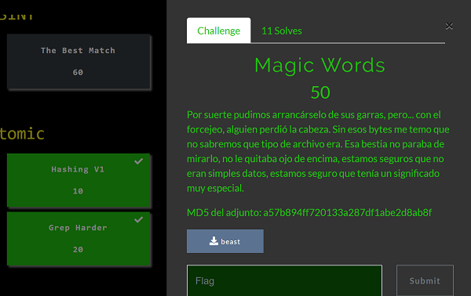

## Description
* **Name:** [Magic Words](https://ctf.bitupalicante.com/challenges#Magic%20Words)
* **Points:** 50
* **Tags:** Forensics, Atomic

<p align="center">

</p>

## Tools
* Firefox 68.2.0esr https://www.mozilla.org/en-US/firefox/68.2.0/releasenotes/
* xxd xxd V1.10 27oct98 by Juergen Weigert

## Writeup

```bash
root@1v4n:~/CTF/bitup19/Atomic/Magic_Words_GRANTED# md5sum beast
a57b894ff720133a287df1abe2d8ab8f  beast
root@1v4n:~/CTF/bitup19/Atomic/Magic_Words_GRANTED# file beast
beast: PDP-11 UNIX/RT ldp
root@1v4n:~/CTF/bitup19/Atomic/Magic_Words_GRANTED# binwalk beast

DECIMAL       HEXADECIMAL     DESCRIPTION
--------------------------------------------------------------------------------

root@1v4n:~/CTF/bitup19/Atomic/Magic_Words_GRANTED# exiftool beast
ExifTool Version Number         : 11.99
File Name                       : beast
Directory                       : .
File Size                       : 28 kB
File Modification Date/Time     : 2019:10:22 21:44:48+02:00
File Access Date/Time           : 2020:06:18 22:17:15+02:00
File Inode Change Date/Time     : 2019:10:26 18:34:16+02:00
File Permissions                : rw-r--r--
Error                           : Unknown file type
root@1v4n:~/CTF/bitup19/Atomic/Magic_Words_GRANTED# strings beast
 $.' ",#
(7),01444
'9=82<.342
!22222222222222222222222222222222222222222222222222
$3br
...
J	SX
Ks	L
@H4$
root@1v4n:~/CTF/bitup19/Atomic/Magic_Words_GRANTED# xxd beast | head
00000000: 0101 0100 6000 6000 00ff db00 4300 0806  ....`.`.....C...
00000010: 0607 0605 0807 0707 0909 080a 0c14 0d0c  ................
00000020: 0b0b 0c19 1213 0f14 1d1a 1f1e 1d1a 1c1c  ................
00000030: 2024 2e27 2022 2c23 1c1c 2837 292c 3031   $.' ",#..(7),01
00000040: 3434 341f 2739 3d38 323c 2e33 3432 ffdb  444.'9=82<.342..
00000050: 0043 0109 0909 0c0b 0c18 0d0d 1832 211c  .C...........2!.
00000060: 2132 3232 3232 3232 3232 3232 3232 3232  !222222222222222
00000070: 3232 3232 3232 3232 3232 3232 3232 3232  2222222222222222
00000080: 3232 3232 3232 3232 3232 3232 3232 3232  2222222222222222
00000090: 3232 32ff c000 1108 019d 02ee 0301 2200  222..........."
```

```bash
root@1v4n:~/CTF/bitup19/Atomic/Magic_Words_GRANTED# xxd <beast | sed '1 s/0101/ffd8/' | xxd -r >beast.jpg
root@1v4n:~/CTF/bitup19/Atomic/Magic_Words_GRANTED# file beast.jpg
beast.jpg: JPEG image data
```

### Flag

`bitup19{n3v3r_l0st_th3_h34d}`

<p align="center">

</p>
