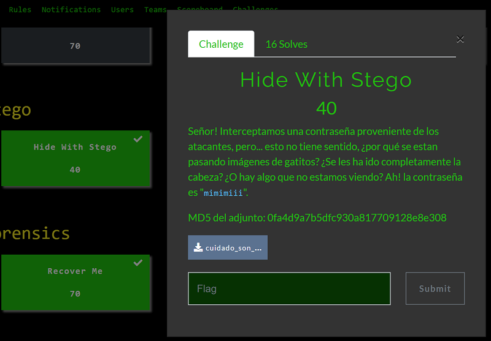

## Description
* **Name:** [Hide With Stego](https://ctf.bitupalicante.com/challenges#)
* **Points:** 40
* **Tags:** Stego

<p align="center">

</p>

## Tools
* Firefox 68.2.0esr https://www.mozilla.org/en-US/firefox/68.2.0/releasenotes/
* binwalk
* exiftool
* steghide version 0.5.1

## Writeup

```bash
root@1v4n:~/CTF/bitup19/Stego/Hide_With_Stego_GRANTED# md5sum cuidado_son_adorables.zip
0fa4d9a7b5dfc930a817709128e8e308  cuidado_son_adorables.zip
root@1v4n:~/CTF/bitup19/Stego/Hide_With_Stego_GRANTED# file cuidado_son_adorables.zip
cuidado_son_adorables.zip: Zip archive data, at least v2.0 to extract
root@1v4n:~/CTF/bitup19/Stego/Hide_With_Stego_GRANTED# strings cuidado_son_adorables.zip
mojadico.jpegUT
P:y]P:y]P:y]ux
gge%+
T)))
[TL\BRYEUM]
...
mojadico.jpegUT
P:y]P:y]P:y]ux
pelusito.jpegUT
x:y]x:y]x:y]ux
shon.jpgUT
i:y]i:y]i:y]ux
root@1v4n:~/CTF/bitup19/Stego/Hide_With_Stego_GRANTED# binwalk -e cuidado_son_adorables.zip

DECIMAL       HEXADECIMAL     DESCRIPTION
--------------------------------------------------------------------------------
0             0x0             Zip archive data, at least v2.0 to extract, uncompressed size: 89650, name: mojadico.jpeg
89298         0x15CD2         Zip archive data, at least v2.0 to extract, uncompressed size: 51788, name: pelusito.jpeg
140780        0x225EC         Zip archive data, at least v2.0 to extract, uncompressed size: 20840, name: shon.jpg
160308        0x27234         End of Zip archive, footer length: 22
root@1v4n:~/CTF/bitup19/Stego/Hide_With_Stego_GRANTED# cd _cuidado_son_adorables.zip.extracted/
root@1v4n:~/CTF/bitup19/Stego/Hide_With_Stego_GRANTED/_cuidado_son_adorables.zip.extracted# ls -la
...
-rw-r--r-- 1 root root  89650 sep 11  2019 mojadico.jpeg
-rw-r--r-- 1 root root  51788 sep 11  2019 pelusito.jpeg
-rw-r--r-- 1 root root  20840 sep 11  2019 shon.jpg
root@1v4n:~/CTF/bitup19/Stego/Hide_With_Stego_GRANTED/_cuidado_son_adorables.zip.extracted# md5sum mojadico.jpeg
397c21e4602085cc2a976b394bf5af86  mojadico.jpeg
root@1v4n:~/CTF/bitup19/Stego/Hide_With_Stego_GRANTED/_cuidado_son_adorables.zip.extracted# file mojadico.jpeg
mojadico.jpeg: JPEG image data, JFIF standard 1.01, aspect ratio, density 1x1, segment length 16, baseline, precision 8, 700x795, components 3
root@1v4n:~/CTF/bitup19/Stego/Hide_With_Stego_GRANTED/_cuidado_son_adorables.zip.extracted# binwalk mojadico.jpeg

DECIMAL       HEXADECIMAL     DESCRIPTION
--------------------------------------------------------------------------------
0             0x0             JPEG image data, JFIF standard 1.01

root@1v4n:~/CTF/bitup19/Stego/Hide_With_Stego_GRANTED/_cuidado_son_adorables.zip.extracted# exiftool mojadico.jpeg

ExifTool Version Number         : 11.94
File Name                       : mojadico.jpeg
Directory                       : .
File Size                       : 88 kB
File Modification Date/Time     : 2019:09:11 20:17:52+02:00
File Access Date/Time           :
File Inode Change Date/Time     :
File Permissions                : rw-r--r--
File Type                       : JPEG
File Type Extension             : jpg
MIME Type                       : image/jpeg
JFIF Version                    : 1.01
Resolution Unit                 : None
X Resolution                    : 1
Y Resolution                    : 1
Image Width                     : 700
Image Height                    : 795
Encoding Process                : Baseline DCT, Huffman coding
Bits Per Sample                 : 8
Color Components                : 3
Y Cb Cr Sub Sampling            : YCbCr4:4:4 (1 1)
Image Size                      : 700x795
Megapixels                      : 0.556
root@1v4n:~/CTF/bitup19/Stego/Hide_With_Stego_GRANTED/_cuidado_son_adorables.zip.extracted# md5sum pelusito.jpeg
2a3664313048f0e06e248729202b7f87  pelusito.jpeg
root@1v4n:~/CTF/bitup19/Stego/Hide_With_Stego_GRANTED/_cuidado_son_adorables.zip.extracted# file pelusito.jpeg
pelusito.jpeg: JPEG image data, JFIF standard 1.01, resolution (DPI), density 96x96, segment length 16, baseline, precision 8, 594x1054, components 3
root@1v4n:~/CTF/bitup19/Stego/Hide_With_Stego_GRANTED/_cuidado_son_adorables.zip.extracted# exiftool pelusito.jpeg
ExifTool Version Number         : 11.94
File Name                       : pelusito.jpeg
Directory                       : .
File Size                       : 51 kB
File Modification Date/Time     : 2019:09:11 20:18:32+02:00
File Access Date/Time           :
File Inode Change Date/Time     :
File Permissions                : rw-r--r--
File Type                       : JPEG
File Type Extension             : jpg
MIME Type                       : image/jpeg
JFIF Version                    : 1.01
Resolution Unit                 : inches
X Resolution                    : 96
Y Resolution                    : 96
Image Width                     : 594
Image Height                    : 1054
Encoding Process                : Baseline DCT, Huffman coding
Bits Per Sample                 : 8
Color Components                : 3
Y Cb Cr Sub Sampling            : YCbCr4:2:0 (2 2)
Image Size                      : 594x1054
Megapixels                      : 0.626
root@1v4n:~/CTF/bitup19/Stego/Hide_With_Stego_GRANTED/_cuidado_son_adorables.zip.extracted# md5sum shon.jpg
39cc4b48c2054aa856600697eb0a182f  shon.jpg
root@1v4n:~/CTF/bitup19/Stego/Hide_With_Stego_GRANTED/_cuidado_son_adorables.zip.extracted# file shon.jpg
shon.jpg: JPEG image data, JFIF standard 1.01, resolution (DPI), density 96x96, segment length 16, baseline, precision 8, 417x424, components 3
root@1v4n:~/CTF/bitup19/Stego/Hide_With_Stego_GRANTED/_cuidado_son_adorables.zip.extracted# exiftool shon.jpg
ExifTool Version Number         : 11.94
File Name                       : shon.jpg
Directory                       : .
File Size                       : 20 kB
File Modification Date/Time     : 2019:09:11 20:18:17+02:00
File Access Date/Time           :
File Inode Change Date/Time     :
File Permissions                : rw-r--r--
File Type                       : JPEG
File Type Extension             : jpg
MIME Type                       : image/jpeg
JFIF Version                    : 1.01
Resolution Unit                 : inches
X Resolution                    : 96
Y Resolution                    : 96
Image Width                     : 417
Image Height                    : 424
Encoding Process                : Baseline DCT, Huffman coding
Bits Per Sample                 : 8
Color Components                : 3
Y Cb Cr Sub Sampling            : YCbCr4:2:0 (2 2)
Image Size                      : 417x424
Megapixels                      : 0.177
root@1v4n:~/CTF/bitup19/Stego/Hide_With_Stego_GRANTED/_cuidado_son_adorables.zip.extracted# steghide info mojadico.jpeg
"mojadico.jpeg":
  formato: jpeg
  capacidad: 5,1 KB
�Intenta informarse sobre los datos adjuntos? (s/n) s
Anotar salvoconducto:
  archivo adjunto "22123124.txt":
    tama�o: 17,0 Byte
    encriptado: rijndael-128, cbc
    compactado: si
root@1v4n:~/CTF/bitup19/Stego/Hide_With_Stego_GRANTED/_cuidado_son_adorables.zip.extracted# steghide extract -sf  mojadico.jpeg
Anotar salvoconducto:
anot� los datos extra�dos e/"22123124.txt".
root@1v4n:~/CTF/bitup19/Stego/Hide_With_Stego_GRANTED/_cuidado_son_adorables.zip.extracted# cat 22123124.txt
Y3V0M19rMXR0Nz8=
root@1v4n:~/CTF/bitup19/Stego/Hide_With_Stego_GRANTED/_cuidado_son_adorables.zip.extracted# printf 'V2gwX3cwdWxkX2QwdWJ0XzBmXzRfY3V0M19rMXR0Nz8='| base64 -d
Wh0_w0uld_d0ubt_0f_4_cut3_k1tt7?
```

### Flag

`bitup19{Wh0_w0uld_d0ubt_0f_4_cut3_k1tt7?}`
