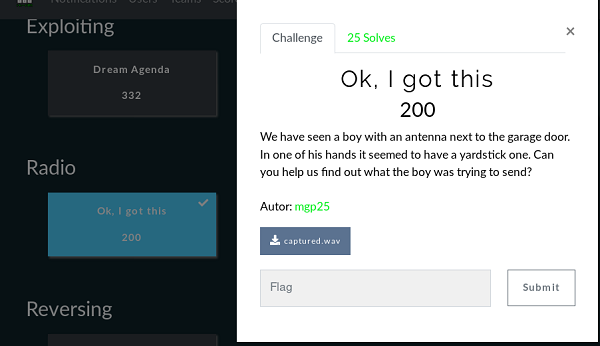
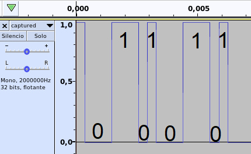

## Description
* **Name:** [Ok, I got this]https://ctf.h-c0n.com/challenges#Ok,%20I%20got%20this)
* **Points:** 200
* **Tag:** Radio
* **Author** [_mgp25](https://twitter.com/_mgp25)
* **Team:** [Gh0st in th3 Cloud H3ll](https://ctf.h-c0n.com/teams/46) Note: *Thanks to Sedekt (aka E4gl3) && lilivx*

<p align="center">

</p>

## Tools
* Firefox 68.2.0esr https://www.mozilla.org/en-US/firefox/68.2.0/releasenotes/
* Audacity v2.3.3 https://www.audacityteam.org/download/

## Writeup
Download the file called captured.wav (b8ca4b81cd3c328e700cffde5d2739f0) with a WAV audio file. We detect an audio with 0,61s and 2Mhz intercepted with RTL-SDR called [Yardstick One](https://greatscottgadgets.com/yardstickone/)
```bash
root@1v4n:~/CTF/hc0n2020/Radio/Ok_I_got_this# md5sum captured.wav
b8ca4b81cd3c328e700cffde5d2739f0  captured.wav
root@1v4n:~/CTF/hc0n2020/Radio/Ok_I_got_this# file captured.wav
captured.wav: RIFF (little-endian) data, WAVE audio, Microsoft PCM, 8 bit, mono
root@1v4n:~/CTF/hc0n2020/Radio/Ok_I_got_this# exiftool captured.wav
ExifTool Version Number         : 11.80
File Name                       : captured.wav
Directory                       : .
File Size                       : 1186 kB
File Modification Date/Time     : 2020:01:13 19:48:43+01:00
File Access Date/Time           : 2020
File Inode Change Date/Time     : 2020:01:13 20:42:43+01:00
File Permissions                : rw-r--r--
File Type                       : WAV
File Type Extension             : wav
MIME Type                       : audio/x-wav
Encoding                        : Microsoft PCM
Num Channels                    : 1
Sample Rate                     : 2000000
Avg Bytes Per Sec               : 2000000
Bits Per Sample                 : 8
Duration                        : 0.61 s
```
We detect On-off keying (OOK) modulation is a further simplification of Amplitude shift-keying (ASK) method. The source sends NO carrier when it wants to send a '0'.
https://blog.attify.com/radio-waves-hacking/

```bash
root@1v4n:~/CTF/hc0n2020/Radio/Ok_I_got_this_GRANTED# audacity captured.wav
```
<p align="center">

</p>

```python
>>> n = int('0b010101000110100001100101001000000110011001101100011000010110011100100000011010010111001100100000010010000010110101100011001100000110111001111011001100100011001100110010001101100110001101100110001100110011011001100010001110000011010000110111001100110110010000110110001100010011000101100100001101000011010000111001011001100011000100110001001101110110010000110000001110010011001100111001001110010110011001111101',2)
>>> n.to_bytes((n.bit_length() + 7) // 8, 'big').decode()
'The flag is H-c0n{2326cf36b8473d611d449f117d09399f}'
```

### Flag

`H-c0n{2326cf36b8473d611d449f117d09399f}`

<p align="center">

</p>
