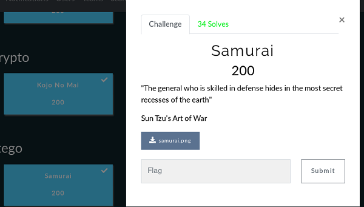
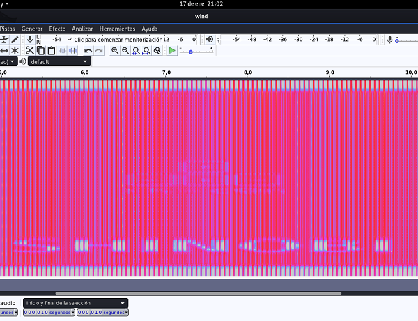
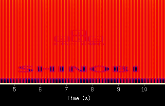
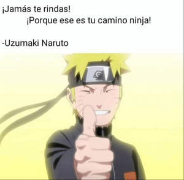

## Description
* **Name:** [Samurai](https://ctf.h-c0n.com/challenges#Samurai)
* **Points:** 200
* **Tag:** Stego
* **Team:** [Gh0st in th3 Cloud H3ll](https://ctf.h-c0n.com/teams/46) Note: *Thanks to Sedekt (aka E4gl3) && lilivx*

<p align="center">

</p>

## Tools
* Firefox 68.2.0esr https://www.mozilla.org/en-US/firefox/68.2.0/releasenotes/
* GNU strings (GNU Binutils for Debian) 2.33.90.20200122
* Binwalk v2.2.0 https://github.com/ReFirmLabs/binwalk
* Audacity v2.3.3 https://www.audacityteam.org/
* SoX v14.4.2 http://sox.sourceforge.net/SoX/Resampling

## Writeup

Download the file called samurai.png (3b372f42d7cae06d04f44eb8490038ef) with a PNG imege file. View all strings in the file with strings -n 7 -t x. We use -n 7 for strings of length 7+, and -t x to view- their position in the file. We detect a WAV audi file embedded. (https://github.com/Ge0rg3/StegOnline/blob/master/src/app/checklist/checklist.component.html)

```bash
root@1v4n:~/CTF/hc0n2020/stego# md5sum samurai.png
3b372f42d7cae06d04f44eb8490038ef  samurai.png
root@1v4n:~/CTF/hc0n2020/stego# file samurai.png
samurai.png: PNG image data, 480 x 720, 8-bit/color RGB, non-interlaced
root@1v4n:~/CTF/hc0n2020/stego# strings -n 7 -t x samurai.png
    17f DJ b"^i
    50c nai8<tHG
    b48 qBgU^NGn5
  ...
  6924e nArH"uV
  69306 tS<C+z5Q
  695c3 K:zt1wj
  6b5cc wind.wav
  root@1v4n:~/CTF/hc0n2020/stego# binwalk -Me samurai.png

  Scan Time:     2020-01-
  Target File:   /root/CTF/hc0n2020/stego/samurai.png
  MD5 Checksum:  3b372f42d7cae06d04f44eb8490038ef
  Signatures:    391

  DECIMAL       HEXADECIMAL     DESCRIPTION
  --------------------------------------------------------------------------------
  0             0x0             PNG image, 480 x 720, 8-bit/color RGB, non-interlaced
  41            0x29            Zlib compressed data, best compression
  161106        0x27552         Zip archive data, at least v2.0 to extract, compressed size: 278566, uncompressed size: 1322620, name: wind.wav
  439800        0x6B5F8         End of Zip archive, footer length: 22


  Scan Time:     2020-01-
  Target File:   /root/CTF/hc0n2020/stego/_samurai.png-0.extracted/29
  MD5 Checksum:  d41d8cd98f00b204e9800998ecf8427e
  Signatures:    391

  DECIMAL       HEXADECIMAL     DESCRIPTION
  --------------------------------------------------------------------------------


  Scan Time:     2020-01-
  Target File:   /root/CTF/hc0n2020/stego/_samurai.png.extracted/wind.wav
  MD5 Checksum:  04416be5a3ab8ef0248150158095ff97
  Signatures:    391

  DECIMAL       HEXADECIMAL     DESCRIPTION
  -------------------------------------------------------------------------------
```
We detect a spectogram with the string "SHINOBI" in the win.wav (04416be5a3ab8ef0248150158095ff97) WAV audio file.

```bash
root@1v4n:~/CTF/hc0n2020/stego/_samurai.png.extracted#
root@1v4n:~/CTF/hc0n2020/stego/_samurai.png.extracted# md5sum wind.wav
04416be5a3ab8ef0248150158095ff97  wind.wav
root@1v4n:~/CTF/hc0n2020/stego/_samurai.png.extracted# file wind.wav
wind.wav: RIFF (little-endian) data, WAVE audio, Microsoft PCM, 16 bit, mono 44100 Hz
root@1v4n:~/CTF/hc0n2020/stego/_samurai.png.extracted# audacity wind.wav
```
<p align="center">

</p>

Alternatively we can automatically generate spectrograms for one or more audio files using SoX (https://arielvb.readthedocs.io/en/latest/docs/commandline/sox.html)

```bash
root@1v4n:~/CTF/hc0n2020/stego# sox wind.wav -n spectrogram
root@1v4n:~/CTF/hc0n2020/stego/samurai_GRANTED/_samurai.png.extracted# md5sum spectrogram.png
108c28dfae99fcd7d8b080aac7c42bb0  spectrogram.png
root@1v4n:~/CTF/hc0n2020/stego/samurai_GRANTED/_samurai.png.extracted#
```
<p align="center">

</p>

We return to the PNG image. We confirm that there is LSB stego with steghide info and use pngcheck -vtp7f to look for optional / correct broken fragments. We discovered a chain that reveals the author of the steganographic tool "dhsdshdhk" -> https://github.com/dhsdshdhk/stegpy.git

```bash
root@1v4n:~/CTF/hc0n2020/stego/_samurai.png.extracted# steghide info wind.wav
"wind.wav":
  formato: wave audio, PCM encoding
  capacidad: 40,4 KB
�Intenta informarse sobre los datos adjuntos? (s/n) s
Anotar salvoconducto:
steghide: �no pude extraer ning�n dato con ese salvoconducto!
root@1v4n:~/CTF/hc0n2020/stego# pngcheck -vtp7f samurai.png
File: samurai.png (439822 bytes)
  chunk IHDR at offset 0x0000c, length 13
    480 x 720 image, 24-bit RGB, non-interlaced
  chunk IDAT at offset 0x00025, length 65536
    zlib: deflated, 32K window, maximum compression
  chunk IDAT at offset 0x10031, length 65536
  chunk IDAT at offset 0x2003d, length 29925
  chunk tEXt at offset 0x2752e, length 16, keyword: Author
    dhsdshdhk
  chunk IEND at offset 0x2754a, length 0
  additional data after IEND chunk
  invalid chunk name "" (14 03 00 00)
  chunk  at offset 0x27556, length 1347093252:  illegal (unless recently approved) unknown, public chunk
  additional data after IEND chunk
:  invalid chunk length (too large)
ERRORS DETECTED in samurai.png
```
We install Stegpy and move on to extract our flag with the help of the password "SHINOBI"

```bash
root@1v4n:~/Stego# git clone https://github.com/dhsdshdhk/stegpy.git
Clonando en 'stegpy'...
remote: Enumerating objects: 256, done.
remote: Total 256 (delta 0), reused 0 (delta 0), pack-reused 256
Recibiendo objetos: 100% (256/256), 6.91 MiB | 3.64 MiB/s, listo.
Resolviendo deltas: 100% (131/131), listo.
root@1v4n:~/Stego# cd stegpy/
root@1v4n:~/Stego/stegpy# pip3 install stegpy
Collecting stegpy
  Downloading https://files.pythonhosted.org/packages/ef/80/c127a260cc523d9e7ffeb054876e387539ca624685d77a70149f1f6ec372/stegpy-0.0.1-py3-none-any.whl
Requirement already satisfied: Pillow in /usr/local/lib/python3.7/dist-packages (from stegpy) (6.2.1)
Requirement already satisfied: cryptography in /usr/local/lib/python3.7/dist-packages (from stegpy) (2.8)
Requirement already satisfied: numpy in /usr/local/lib/python3.7/dist-packages (from stegpy) (1.16.1)
Requirement already satisfied: six>=1.4.1 in /usr/lib/python3/dist-packages (from cryptography->stegpy) (1.13.0)
Requirement already satisfied: cffi!=1.11.3,>=1.8 in /usr/local/lib/python3.7/dist-packages (from cryptography->stegpy) (1.13.2)
Requirement already satisfied: pycparser in /usr/local/lib/python3.7/dist-packages (from cffi!=1.11.3,>=1.8->cryptography->stegpy) (2.19)
Installing collected packages: stegpy
Successfully installed stegpy-0.0.1
root@1v4n:~/CTF/hc0n2020/stego/_samurai.png.extracted# cd ..
root@1v4n:~/CTF/hc0n2020/stego# stegpy samurai.png -p
Enter password (will not be echoed):
H-c0n{3899dcbab79f92af727c2190bbd8abc5}
root@1v4n:~/Crypto/MD5-Cracker# buster -s 3899dcbab79f92af727c2190bbd8abc5
_  _ ____ ____ _  _    ___  _  _ ____ ___ ____ ____
|__| |__| [__  |__|    |__] |  | [__   |  |___ |__/
|  | |  | ___] |  |    |__] |__| ___]  |  |___ |  \  v3.0

[!] Hash function : MD5
ninja
```
### Flag

`H-c0n{3899dcbab79f92af727c2190bbd8abc5}`

<p align="center">

</p>
