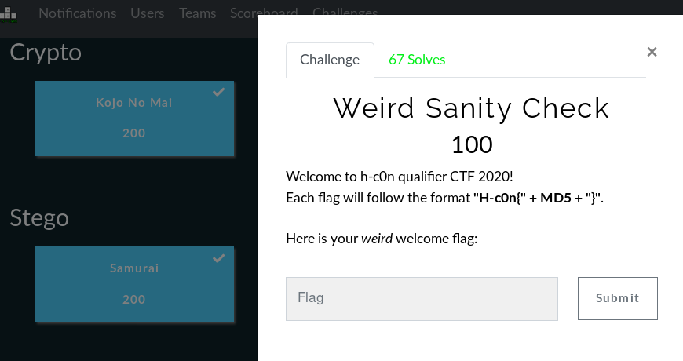
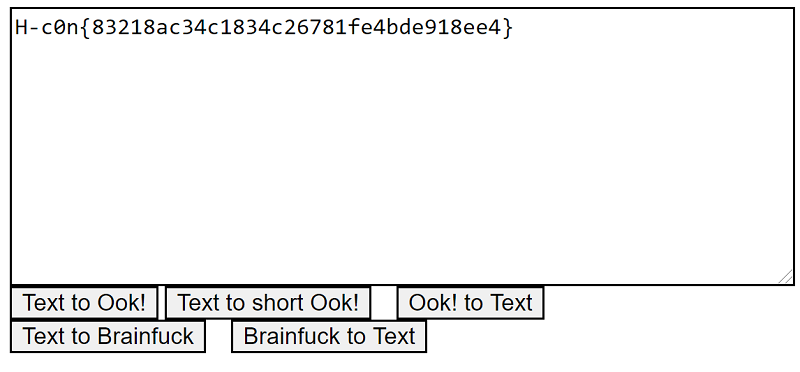

## Description
* **Name:** [Weird Sanity Check](https://ctf.h-c0n.com/challenges#Weird%20Sanity%20Check
)
* **Points:** 100
* **Tag:** Misc
* **Team:** [Gh0st in th3 Cloud H3ll](https://ctf.h-c0n.com/teams/46) Note: *Thanks to Sedekt (aka E4gl3) && lilivx*

<p align="center">

</p>

## Tools
* Firefox 68.2.0esr https://www.mozilla.org/en-US/firefox/68.2.0/releasenotes/
* The Ook and Brainfuck Encoder/Decoder https://github.com/splitbrain/ook

## Writeup
Inspectect the code with Firefox *Ctrl+Shift+C*. We found a hidden string encoded in Base32 Hide table using [<div style="display:none">](https://stackoverflow.com/questions/6910349/hiding-table-data-using-div-style-displaynone). Which in turn hides another obfuscated chain with an esoteric programming language called ["Brainfuck"] (https://esolangs.org/wiki/Brainfuck).
```html
...
<p>Welcome to h-c0n qualifier CTF 2020!<br>
Each flag will follow the format <b>"H-c0n{" + MD5 + "}"</b>.<br>
<br>
Here is your <i>weird</i> welcome flag:<br></p>
<div style="display:none;"><b>FMVSWKZLFMVSWKZLLM7CWPRLFMVT4KZLFMVSWKZLHYVSWKZLFMVSWKZLFM6DYPB4FVOT4PR6FMVS4PBLFMVSWKZLFMVSWKZLFMVSWKZOHY7C2LR4HQVSWKZOHY7CWKZLFMVSWKZLFMVSWLRLFMVSWKZLFMVSWKZLFMVS4PB4FMVSWKZLFMVSWLRNFUWS2LJOFUXC2LRLFMVSWKZLFMXD4KZLFMVSWKZLFMVSWKZLFMVSWKZLFMVSWKZLFMVSWLRLFMXDYLJNFUWS2LRLFY7C4PBNFUWS4KZLFMVSWKZLFYWS2LJNFUXCWLR6FY6C2LJOFMVSWKZOFMXCWLRNFUWS2LJNFUXD4KZLFMXC2LR4FMVSWLR6FUWS2LRLFMXCWLR4FMVSWKZLFYWS2LJNFUWS2LJOFMVSWKZLFMVS4PROFY6C2LJNFUXD4PRLFMXA====</b></div>
...
```
Decoded the string in Base32 and Brainfuck. Visited https://www.splitbrain.org/_static/ook/ to decode the Flag.
```python
printf 'FMVSWKZLFMVSWKZLLM7CWPRLFMVT4KZLFMVSWKZLHYVSWKZLFMVSWKZLFM6DYPB4FVOT4PR6FMVS4PBLFMVSWKZLFMVSWKZLFMVSWKZOHY7C2LR4HQVSWKZOHY7CWKZLFMVSWKZLFMVSWLRLFMVSWKZLFMVSWKZLFMVS4PB4FMVSWKZLFMVSWLRNFUWS2LJOFUXC2LRLFMVSWKZLFMXD4KZLFMVSWKZLFMVSWKZLFMVSWKZLFMVSWKZLFMVSWLRLFMXDYLJNFUWS2LRLFY7C4PBNFUWS4KZLFMVSWKZLFYWS2LJNFUXCWLR6FY6C2LJOFMVSWKZOFMXCWLRNFUWS2LJNFUXD4KZLFMXC2LR4FMVSWLR6FUWS2LRLFMXCWLR4FMVSWKZLFYWS2LJNFUWS2LJOFMVSWKZLFMVS4PROFY6C2LJNFUXD4PRLFMXA====' | base32 -d
++++++++++[>+>+++>+++++++>++++++++++<<<<-]>>>++.<+++++++++++++++.>>-.<<+++.>>+++++++++++.+++++++++++++.<<++++++++.-----.-.-.+++++++.>+++++++++++++++++++++++++.++.<-----.+.>.<---.+++++++.-----.+.>.<--.++++.+.+.-------.>+++.-.<+++.>---.++.+.<+++++.--------.+++++++.>..<----.>>++.
```

<p align="center">

</p>

Found : Welcome
(hash = 83218ac34c1834c26781fe4bde918ee4)

### Flag

`H-c0n{83218ac34c1834c26781fe4bde918ee4}`

<p align="center">

</p>
