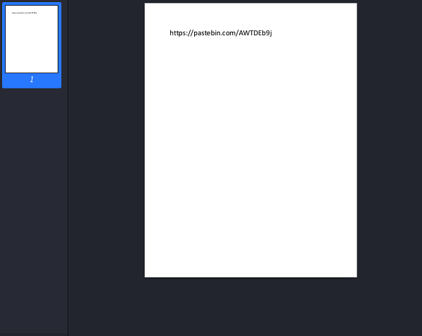
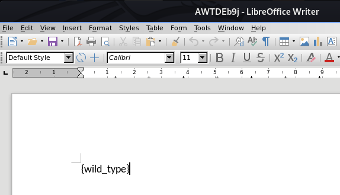

## Description
* **Name:** [Choose your Pokemon](https://2019.peactf.com/problems)
* **Points:** 150
* **Tag:** Forensics

<p align="center">

</p>

## Tools
* Firefox Version 60.8.0 https://www.mozilla.org/en-US/firefox/60.8.0/releasenotes/
* file-5.37 https://packages.debian.org/es/sid/file
* GNU strings (GNU Binutils for Debian) https://tracker.debian.org/pkg/binutils
* 7-Zip [64] 16.02 : Copyright (c) 1999-2016 Igor Pavlov : 2016-05-21 https://packages.debian.org/es/sid/p7zip
* Gio https://manpages.debian.org/buster/libglib2.0-bin/gio.1.en.html


## Writeup
Download the file called master-ball (c09256264522845746746d85bb0cc61d) through the link where we find a RAR archive data file.

```bash
root@1v4n:~/CTF/peaCTF2019/crypto/Pokemon# wget https://shell1.2019.peactf.com/static/a4836f4c3f6a10f05c2383a4486bd934/enc.txt
root@1v4n:~/CTF/peaCTF2019/Forensics/Pokemon# md5sum master-ball
c09256264522845746746d85bb0cc61d  master-ball
root@1v4n:~/CTF/peaCTF2019/Forensics/Pokemon# file master-ball
master-ball: RAR archive data, v5
root@1v4n:~/CTF/peaCTF2019/Forensics/Pokemon# ls -lah
total
drwxr-xr-x 2 root root 4,0K jul 27 19:38 .
drwxr-xr-x 6 root root 4,0K jul 27 19:40 ..
-rw-r--r-- 1 root root  36K jul 21 21:16 master-ball
root@1v4n:~/CTF/peaCTF2019/Forensics/Pokemon# strings master-ball
Rar!
roshambo
J,$$
inDesign
...
inDesign
roshambo
J,$$
root@1v4n:~/CTF/peaCTF2019/Forensics/Pokemon#cp master-ball master-ball.rar
root@1v4n:~/CTF/peaCTF2019/Forensics/Pokemon_GRANTED# 7z x master-ball.rar

7-Zip [64] 16.02 : Copyright (c) 1999-2016 Igor Pavlov : 2016-05-21
p7zip Version 16.02 (locale=es_ES.UTF-8,Utf16=on,HugeFiles=on,64 bits,2 CPUs Intel(R) Core(TM) i7-6500U CPU @ 2.50GHz (406E3),ASM,AES-NI)

Scanning the drive for archives:
1 file, 36038 bytes (36 KiB)

Extracting archive: master-ball.rar
--
Path = master-ball.rar
Type = Rar5
Physical Size = 36038
Solid = -
Blocks = 1
Encrypted = -
Multivolume = -
Volumes = 1

Everything is Ok

Size:       35891
Compressed: 36038
root@1v4n:~/CTF/peaCTF2019/Forensics/Pokemon_GRANTED# ls -la
total
drwxr-xr-x 2 root root  4096 jul 27 19:38 .
drwxr-xr-x 6 root root  4096 jul 27 19:40 ..
-rw-r--r-- 1 root root 36038 jul 21 21:16 master-ball
-rw-r--r-- 1 root root 36038 jul 25 20:46 master-ball.rar
-rw-r--r-- 1 root root 35891 jul 21 08:33 roshambo
root@1v4n:~/CTF/peaCTF2019/Forensics/Pokemon# md5sum roshambo
c872700424a2ba07701fe9796726c8e5  roshambo
root@1v4n:~/CTF/peaCTF2019/Forensics/Pokemon# file roshambo
roshambo: Zip archive data, at least v2.0 to extract
root@1v4n:~/CTF/peaCTF2019/Forensics/Pokemon_GRANTED# strings roshambo
inDesign
...
inDesign
root@1v4n:~/CTF/peaCTF2019/Forensics/Pokemon# cp roshambo roshambo.zip
root@1v4n:~/CTF/peaCTF2019/Forensics/Pokemon# 7z x roshambo.zip

7-Zip [64] 16.02 : Copyright (c) 1999-2016 Igor Pavlov : 2016-05-21
p7zip Version 16.02 (locale=es_ES.UTF-8,Utf16=on,HugeFiles=on,64 bits,2 CPUs Intel(R) Core(TM) i7-6500U CPU @ 2.50GHz (406E3),ASM,AES-NI)

Scanning the drive for archives:
1 file, 35891 bytes (36 KiB)

Extracting archive: roshambo.zip
--
Path = roshambo.zip
Type = zip
Physical Size = 35891

Everything is Ok

Size:       40013
Compressed: 35891
root@1v4n:~/CTF/peaCTF2019/Forensics/Pokemon_GRANTED# ls -la
total
drwxr-xr-x 2 root root  4096 jul 27 19:38 .
drwxr-xr-x 6 root root  4096 jul 27 19:40 ..
-rw-r--r-- 1 root root 40013 jul 21 08:30 inDesign
-rw-r--r-- 1 root root 36038 jul 21 21:16 master-ball
-rw-r--r-- 1 root root 36038 jul 25 20:46 master-ball.rar
-rw-r--r-- 1 root root 35891 jul 21 08:33 roshambo
-rw-r--r-- 1 root root 35891 jul 25 20:47 roshambo.zip
root@1v4n:~/CTF/peaCTF2019/Forensics/Pokemon# md5sum inDesign
c3e83aac4d0fc2b867d9f829c10317a5  inDesign
root@1v4n:~/CTF/peaCTF2019/Forensics/Pokemon# file inDesign
inDesign: PDF document, version 1.7
root@1v4n:~/CTF/peaCTF2019/Forensics/Pokemon_GRANTED# exiftool inDesign
ExifTool Version Number         : 11.76
File Name                       : inDesign
Directory                       : .
File Size                       : 39 kB
File Modification Date/Time     : 2019:
File Access Date/Time           : 2019:12:30 20:29:12+01:00
File Inode Change Date/Time     : 2019:12:30 20:26:28+01:00
File Permissions                : rw-r--r--
File Type                       : PDF
File Type Extension             : pdf
MIME Type                       : application/pdf
PDF Version                     : 1.7
Linearized                      : No
Page Count                      : 1
Language                        : en-US
Tagged PDF                      : Yes
XMP Toolkit                     : 3.1-701
Producer                        : Microsoft® Word for Office 365
Creator                         : Orion Bloomfield
Creator Tool                    : Microsoft® Word for Office 365
Create Date                     : 2019:07:20 23:29:59-07:00
Modify Date                     : 2019:07:20 23:29:59-07:00
Document ID                     : uuid:E6C91BCD-1754-4E5B-882B-ABB71F5D720C
Instance ID                     : uuid:E6C91BCD-1754-4E5B-882B-ABB71F5D720C
Author                          : Orion Bloomfield
```
<p align="center">

</p>
```bash
root@1v4n:~/CTF/peaCTF2019/Forensics/Pokemon_GRANTED# wget https://pastebin.com/raw/AWTDEb9j
--2019 20:42:00--  https://pastebin.com/raw/AWTDEb9j
Resolviendo pastebin.com (pastebin.com)... 104.20.67.143, 104.20.68.143, 2606:4700:10::6814:438f, ...
Conectando con pastebin.com (pastebin.com)[104.20.67.143]:443... conectado.
Petición HTTP enviada, esperando respuesta... 200 OK
Longitud: no especificado [text/plain]
Grabando a: “AWTDEb9j”

AWTDEb9j                             [ <=>                                                       ]  41,89K  --.-KB/s    en 0,009s  

2019 20:42:00 (4,44 MB/s) - “AWTDEb9j” guardado [42892]
root@1v4n:~/CTF/peaCTF2019/Forensics/Pokemon# md5sum AWTDEb9j
8ee4dcb2e8381bf9439685276e18b369  AWTDEb9j
root@1v4n:~/CTF/peaCTF2019/Forensics/Pokemon# file AWTDEb9j
AWTDEb9j: Rich Text Format data, version 1, unknown character set
root@1v4n:~/CTF/peaCTF2019/Forensics/Pokemon# ls -la
total
drwxr-xr-x 2 root root  4096 jul 27 20:42 .
drwxr-xr-x 6 root root  4096 jul 27 19:40 ..
-rw-r--r-- 1 root root 42892 dic 30 20:42 AWTDEb9j
-rw-r--r-- 1 root root 40013 jul 21 08:30 inDesign
-rw-r--r-- 1 root root 36038 jul 21 21:16 master-ball
-rw-r--r-- 1 root root 36038 jul 25 20:46 master-ball.rar
-rw-r--r-- 1 root root 35891 jul 21 08:33 roshambo
-rw-r--r-- 1 root root 35891 jul 25 20:47 roshambo.zip
root@1v4n:~/CTF/peaCTF2019/Forensics/Pokemon# gio open AWTDEb9j
```
<p align="center">

</p>

### Flag
`peaCTF{wild_type}`
