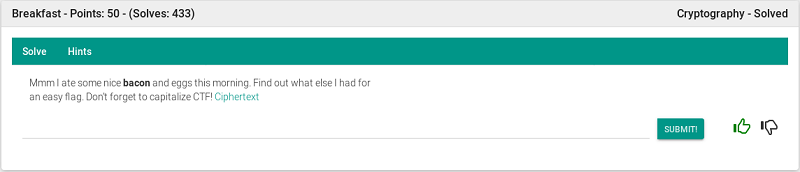
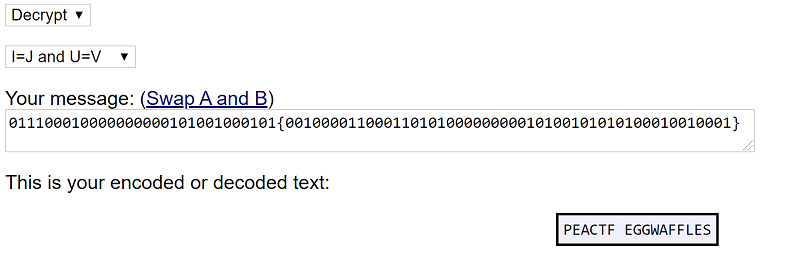

## Description
* **Name:** [Breakfast](https://2019.peactf.com/problems)
* **Points:** 50
* **Tag:** Crypto

<p align="center">

</p>

## Tools
* Firefox Version 60.7.0 https://www.mozilla.org/en-US/firefox/60.8.0/releasenotes/
* Baconian Cipher/Decipher http://rumkin.com/tools/cipher/baconian.php

## Writeup
Download the file called enc.txt (ce9b5ebdbd28295013f084b5acd487e6) through the link where we find a [Baconian](http://rumkin.com/tools/cipher/baconian.php) message code.

```bash
root@1v4n:~/CTF/peaCTF2019/crypto/Breakfast# wget https://shell1.2019.peactf.com/static/fa2ff378dd2e1361fcf19cdf92e5d6f0/enc.txt
root@1v4n:~/CTF/peaCTF2019/crypto/Breakfast# md5sum enc.txt
ce9b5ebdbd28295013f084b5acd487e6  enc.txt
root@1v4n:~/CTF/peaCTF2019/crypto/Breakfast# file enc.txt
enc.txt: ASCII text
root@1v4n:~/CTF/peaCTF2019/crypto/Breakfast_GRANTED# cat enc.txt
011100010000000000101001000101{00100001100011010100000000010100101010100010010001
```
We use the rumkin online tool to decode the message >
<p align="center">

</p>

or with the following python script

```python
#! /usr/bin/python

lookup = {'A':'00000', 'B':'00001', 'C':'00010', 'D':'00011', 'E':'00100',
		'F':'00101', 'G':'00110', 'H':'00111', 'I':'01000', 'K':'01001',
		'L':'01010', 'M':'01011', 'N':'01100', 'O':'01101', 'P':'01110',
		'Q':'01111', 'R':'10000', 'S':'10001', 'T':'10010', 'U':'10011',
		'W':'10100', 'X':'10101', 'Y':'10110', 'Z':'10111'}

def decrypt(message):
	decipher = ''
	i = 0

	while True :
		if(i < len(message)-4):
			substr = message[i:i + 5]
			if(substr[0] != ' '):

				decipher += list(lookup.keys())[list(lookup.values()).index(substr)]
				i += 5

			else:
				decipher += ' '
				i += 1
		else:
			break

	return decipher

def main():
	message = "01110001000000000010100100010100100001100011010100000000010100101010100010010001"
	result = decrypt(message)
	print (result.lower())

if __name__ == '__main__':
	main()
```
```bash
root@1v4n:~/CTF/peaCTF2019/crypto/Breakfast# python get_flag.py
peactfeggwaffles
```
We capitalize CTF >

### Flag

`peaCTF{eggwaffles}`
