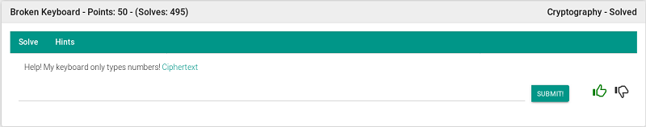
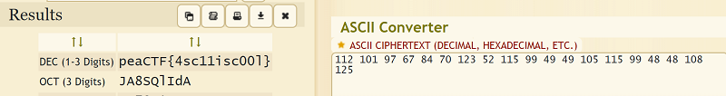

## Description
* **Name:** [Broken Keyboard](https://2019.peactf.com/problems)
* **Points:** 50
* **Tag:** Crypto

<p align="center">

</p>

## Tools
* Firefox Version 60.8.0 https://www.mozilla.org/en-US/firefox/60.8.0/releasenotes/
* ASCII Cipher/Decipher https://www.dcode.fr/ascii-code

## Writeup
Download the file called enc.txt (4fc5d4517a98bd97fede504d6f5e42bc) through the link where we find a [ASCII](https://ascii.cl/es/referencias.htm) code.

```bash
root@1v4n:~/CTF/peaCTF2019/crypto/Broken_Keyboard# wget https://shell1.2019.peactf.com/static/a993b6d91714b32556129ca0167b97ed/enc.txt
root@1v4n:~/CTF/peaCTF2019/crypto/Broken_Keyboard# md5sum enc.txt
4fc5d4517a98bd97fede504d6f5e42bc  enc.txt
root@1v4n:~/CTF/peaCTF2019/crypto/Broken_Keyboard_GRANTED# file enc.txt
enc.txt: ASCII text
root@1v4n:~/CTF/peaCTF2019/crypto/Broken_Keyboard_GRANTED# cat enc.txt
112 101 97 67 84 70 123 52 115 99 49 49 105 115 99 48 48 108 125
```
We use the ASCII online tool to decode the message >
<p align="center">

</p>

or with the following python script

```python
#! #!/usr/bin/env python

l = [112, 101, 97, 67, 84, 70, 123, 52, 115, 99, 49, 49, 105, 115, 99, 48, 48, 108, 125]

s = "".join([chr(c) for c in l])

print s
```
```bash
root@1v4n:~/CTF/peaCTF2019/crypto/Broken_Keyboard_GRANTED# python get_flag.py
peaCTF{4sc11isc00l}
```

### Flag
```                _____ _______ ______ ___  _           __ __ _           ___   ___  ___   
                  / ____|__   __|  ____/ / || |         /_ /_ (_)         / _ \ / _ \| \ \  
 _ __   ___  __ _| |       | |  | |__ | || || |_ ___  ___| || |_ ___  ___| | | | | | | || |
| '_ \ / _ \/ _` | |       | |  |  __/ / |__   _/ __|/ __| || | / __|/ __| | | | | | | | \ \
| |_) |  __/ (_| | |____   | |  | |  \ \    | | \__ \ (__| || | \__ \ (__| |_| | |_| | | / /
| .__/ \___|\__,_|\_____|  |_|  |_|   | |   |_| |___/\___|_||_|_|___/\___|\___/ \___/|_|| |
| |                                    \_\                                             /_/  
|_|                                                                                         
```                                    
