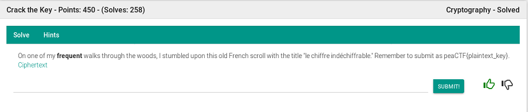
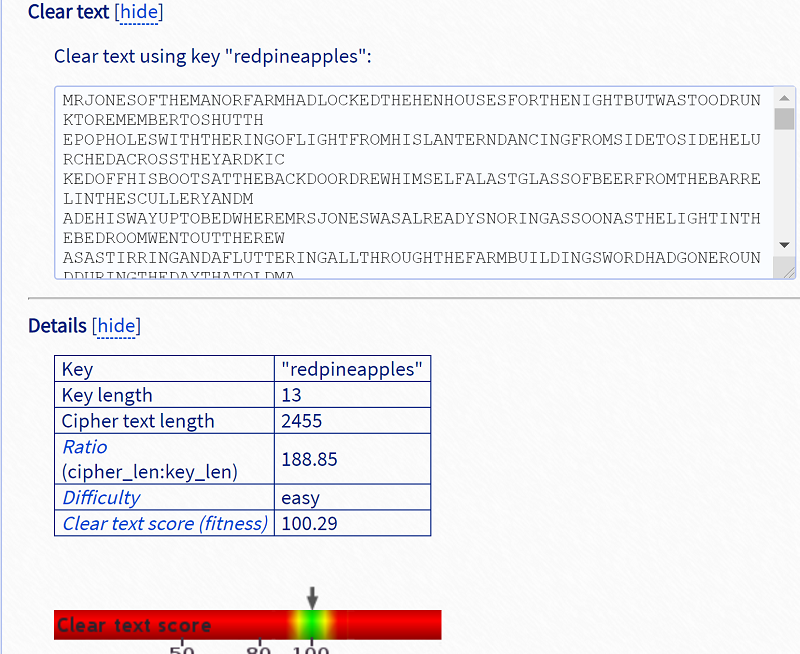

## Description
* **Name:** [Crack the key](https://2019.peactf.com/problems)
* **Points:** 450
* **Tag:** Crypto

<p align="center">

</p>

## Tools
* Firefox Version 60.8.0 https://www.mozilla.org/en-US/firefox/60.8.0/releasenotes/
* Vigenere Solver https://www.guballa.de/vigenere-solver
* Vigenere cipher breaker https://planetcalc.com/7956/#calculator7948
* Vigenere-Cipher-Breaker https://github.com/drewp41/Vigenere-Cipher-Breaker

## Writeup
Download the file called enc.txt (954283747bbbcc4caf8a684a5bde520a) through the link where we find a Vigenere cipher text.

```bash
root@1v4n:~/CTF/peaCTF2019/crypto/Crackthekey# wget https://shell1.2019.peactf.com/static/a4836f4c3f6a10f05c2383a4486bd934/enc.txt
root@1v4n:~/CTF/peaCTF2019/crypto/Crackthekey# md5sum enc.txt
954283747bbbcc4caf8a684a5bde520a  enc.txt
root@1v4n:~/CTF/peaCTF2019/crypto/Crackthekey# file enc.txt
enc.txt: ASCII text
root@1v4n:~/CTF/peaCTF2019/crypto/Crackthekey# cat enc.txt
DVMDVRWOUISIERRRGNNVMWPOPGTOHSBUIHTCSSMJIVUWEXHTCTKZKFXIENWTDDOVMEOWDZRQEBQPVLFWKJBGL
EEDALGCIVLQGLTWTCMFXSIAQTLTUGZQZZWOPVGIRCSLRUZRJUZBQSXSPXGJMGTPRPUGRSIVRGUDAFXHTNLVVBMF
ZMQSFUWTWTFSWHIGXHTQLGCUSRGLEIWWXXWWCJDAIFXGAPDWGWFHTZSVOBISITRVUTTVRTWTDGMCPHGGNRDB
POIZZWZPGHTTDQPHOYIUTUEWJDCPWORWDAZREDNHYSJZRJPAFSOCPDXZVPLVPGMNIWPFWUVRDUJINIDFXLYIUTE
NWAHITVJZRJPVQEFAJEXWIMQVIYPTWGZYYYXKTNNVMQJTPVZRJHEBVDWPOKGEIUDCAHDJGTRYKLHSILXHPIZPVDE
MDZGLEEGTDWDMGSTRAHXIPFGRVKPLUEDPHEVSEKHSZREMDCELWGVHKQBYSCXRLLRRGLQFLESIZGGDQXCQPETT
XEXGKLHDBUIRPCTQSCWLIPNHBTTYEYIIHSBUETIWPCKYSXALNPLBTPXAEXKTJVKBPGYEKJSRCIFQRYDYIKNEVHISILN
DFXGWXKTENCOASXEBFVVDPRAAHPWASPWFPTYIDIWZYYYXKTVNQEJCOIJNLLRPUIHPSMIWEIAWQOMTTSHEKNMOAQ
AKDDCMISLXBLIFWOWXRLDPVHVIEHESDYXZVJDGUGLAITGIJPSQTENWQJXEIJVEGNBBPOHTLRZFYUHAYIEEXYSJUIUI
WUIAGLSELYIKPLGSSPNLXGEIHCLBJTWTMMYSEUCWAESDGESXIELHMQTLPIQSJDQDYWEAAHPWVWRHBTVFGOCRPH
GELLHJRHOUHEVSNYQSMEELPCEIJEAKXKULUCVQVGDEETIZLELPDXOVPYTGRERHDWHSEHKPLYETTAJKJFAQGIGLEG
HESMKFXIPRAAHHEMDCEPPRRWTXRWSGBMQVXVKWXISEOZWHPVQFECTGSDVRWPXCIAGPYGWZRVEQGIOUISIXRG
WIPNXHXHEYKYIVWIQREKTCFWVRFJBOIFDGPPGEKWWMBXHTGLRADEOHJRKACIZEJIMYTIAHMPZPXZVQVTTIISRDXJGI
XDQTREFITCXZVMUSQSJEGTYXXRWKXWAWFXGDXURQHIPRXHGTPHGXWEACRFEAAUIKJMHPVQTICRSIJRRGIPRRTWT
AMYJAKDARXTATOHGNRLCBUISIGLAADQHSQNXEANTRXISQIWSXHTEWELWSUBBUIHTCDTWIGKTLGLEBHPPNVWRCBU
IWXCOSOJMOAAGLEEXRIGEWIACGXEGTOYHKSWWMEEFITCWLYIVWMRTACSNSOJPDNLBANQTSMFUXKTXVKSPCOFW
XEQIWPLELISIULHWWMGAORPCXZFVVTAOSXTGLRVTPRKMEGABTTRLFKHIPRVWPAVMFXZHGGFPOLAJEFUWHIBVRGS
DHRLYILGDNWTWPTVQYSRUAJMTWVCISKGDGMYISIISIJVWKDCYHBTHZQWJQDATNRIBPWGGEGHPTRHICISIKKVDLKYS
VTGHEKRWWDCGQOIWPVDPQDGMNTPGDLGZZRJBQQHLTATJWNLRWIQREKTCUMZXHVWGLEGUTKMIIEPKXEFITCLWIJ
RJZGLFDPWFGOIULIFENTCZVEFYVQMNWTCTLVDPILVPGIECWLRVJLLVPNRDPHDXJFRJPANRYILZSJUMQPZLLOGHPWH
LXWDORXHTGLAZZXHHBEMPTSZAFYMVCWFIGPKPLADEVDURAHPIDXMGMGPXCIAGPYGWRRGXVSECIWPASJRRIWSJI
GHEVSKILCBRPLXVPRUVFXIPRAAHJYMNVVVPTYCRTHAIUKIGUWELIHHEISUMQTAFSFRWLVSTXHGIAHTGTXIFUSXHXBA
EGHZJOFVNPNGIRIWPLGIWHHKNQEBJCMWCXKTEUMTTVZELRRGQMANABXYXZVHRCSRCBTCUEEZRZPAGLEDAOIKKE
QXUNPOCISIXRVPPVQXHTLZVKKXHBXRVESWPWWCHRBBNPKTSLRVNLHCPRHISXEASJYVJIYPYIDXECVWRBMPCNXRL
PJVQDGSSSRXCDXSEGHWMJSUASDEQKLDIOBHHPSRMNVRKXUNXAXAESCVISIPRJLXTDSXWFXIBUETWTHSMCHVDWA
IRWPGIZRHQDBNMLPCORGWPLTANPOCTLQGEKWWMNRIBPWWGEXKTNNVMWTYINVVOPCTLESXQEKBIGLPLLELDFPVJ
EBIPNXHTHLAFFXKXVTXOAPFKZRXQTDRVTWTWIKJALIPBYTDEPRDPEGBQGXICVTXZVADHLRZOITOXGSSATZGLEILZSX
KLHBCFYAAAJWHVRWIPRMRHJYHSPWWDORXHTGTRLYIVBIYPPPSOSUBFHNWAHTWTZVUYEUSOEEZXCRWAUIENAVH
EPCORWMIUHXREKXCR
```
We use the Vigenere online tool to break the message >
<p align="center">

</p>

or we remove spaces, tabs, carriage returns and newlines. After we break de vigenere code with Vigenere-Cipher-Breaker python tool.

```bash
cat enc.txt | tr -d '\040\011\012\015' > output.txt
root@1v4n:~/CTF/peaCTF2019/crypto/School# git clone https://github.com/drewp41/Vigenere-Cipher-Breaker.git
root@1v4n:~/CTF/peaCTF2019/crypto/School/Vigenere-Cipher-Breaker# python Vigenere_cipher.py
Enter e to encrypt, or d to decrypt: d
Enter ciphertext to decrypt:
...
Do you know the key to decrypt with? Enter y or n: n
Key length is most likely 13
Key: redpineapples
Plaintext: mrjonesofthemanorfarmhadlockedthehenhousesforthenightbutwastoodrunktoremembertoshutthepopholeswiththeringoflightfromhislanterndancingfromsidetosidehelurchedacrosstheyardkickedoffhisbootsatthebackdoordrewhimselfalastglassofbeerfromthebarrelinthesculleryandmadehiswayuptobedwheremrsjoneswasalreadysnoringassoonasthelightinthebedroomwentouttherewasastirringandaflutteringallthroughthefarmbuildingswordhadgoneroundduringthedaythatoldmajortheprizemiddlewhiteboarhadhadastrangedreamonthepreviousnightandwishedtocommunicateittotheotheranimalsithadbeenagreedthattheyshouldallmeetinthebigbarnassoonasmrjoneswassafelyoutofthewayoldmajorsohewasalwayscalledthoughthenameunderwhichhehadbeenexhibitedwaswillingdonbeautywassohighlyregardedonthefarmthateveryonewasquitereadytoloseanhourssleepinordertohearwhathehadtosayatoneendofthebigbarnonasortofraisedplatformmajorwasalreadyensconcedonhisbedofstrawunderalanternwhichhungfromabeamhewastwelveyearsoldandhadlatelygrownratherstoutbuthewasstillamajesticlookingpigwithawiseandbenevolentappearanceinspiteofthefactthathistusheshadneverbeencutbeforelongtheotheranimalsbegantoarriveandmakethemselvescomfortableaftertheirdifferentfashionsfirstcamethethreedogsbluebelljessieandpincherandthenthepigswhosettleddowninthestrawimmediatelyinfrontoftheplatformthehensperchedthemselvesonthewindowsillsthepigeonsfluttereduptotheraftersthesheepandcowslaydownbehindthepigsandbegantochewthecudthetwocarthorsesboxerandclovercameintogetherwalkingveryslowlyandsettingdowntheirvasthairyhoofswithgreatcarelestthereshouldbesomesmallanimalconcealedinthestrawcloverwasastoutmotherlymareapproachingmiddlelifewhohadneverquitegotherfigurebackafterherfourthfoalboxerwasanenormousbeastnearlyeighteenhandshighandasstrongasanytwoordinaryhorsesputtogetherawhitestripedownhisnosegavehimasomewhatstupidappearanceandinfacthewasnotoffirstrateintelligencebuthewasuniversallyrespectedforhissteadinessofcharacterandtremendouspowersofworkafterthehorsescamemurielthewhitegoatandbenjaminthedonkeybenjaminwastheoldestanimalonthefarmandtheworsttemperedheseldomtalkedandwhenhediditwasusuallytomakesomecynicalremarkforinstancehewouldsaythatgodhadgivenhimatailtokeepthefliesoffbutthathewouldsoonerhavehadnotailandnofliesaloneamongtheanimalsonthefarmheneverlaughedifaskedwhyhewouldsaythathesawnothingtolaughatneverthelesswithoutopenlyadmittingithewasdevotedtoboxerthetwoofthemusuallyspenttheirsundaystogetherinthesmallpaddockbeyondtheorchardgrazingsidebysideandneverspeakingnwxpsyugbpplrpnlnvalbyrlnzppngbjyewneps
```

### Flag
`peaCTF{redpineapples}`
