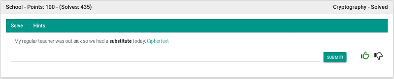
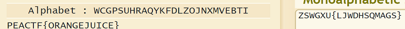

## Description
* **Name:** [School](https://2019.peactf.com/problems)
* **Points:** 100
* **Tag:** Crypto

<p align="center">

</p>

## Tools
* Firefox Version 60.8.0 https://www.mozilla.org/en-US/firefox/60.8.0/releasenotes/
* Alphabetical Substitution https://www.dcode.fr/ascii-code
* Cryptovenom https://github.com/lockedbyte/cryptovenom

## Writeup
Download the file called enc.txt (4fc5d4517a98bd97fede504d6f5e42bc) through the link where we find a [ASCII](https://ascii.cl/es/referencias.htm) code.

```bash
root@1v4n:~/CTF/peaCTF2019/crypto/School# wget https://shell1.2019.peactf.com/static/6999a90c2dc921d2e0de4720df921549/enc.txt
root@1v4n:~/CTF/peaCTF2019/crypto/School# md5sum enc.txt
e0aee564db0a8f5f26118817784859ef  enc.txt
root@1v4n:~/CTF/peaCTF2019/crypto/School# file enc.txt
enc.txt: UTF-8 Unicode text
root@1v4n:~/CTF/peaCTF2019/crypto/School# cat enc.txt
Alphabet: ​WCGPSUHRAQYKFDLZOJNXMVEBTI
zswGXU{ljwdhsqmags}
```
We use the AS online tool to decipher the message >
<p align="center">

</p>

or with Cryptovenom python tool

```bash
root@1v4n:~/CTF/peaCTF2019/crypto/School# git clone https://github.com/lockedbyte/cryptovenom.git
root@1v4n:~/CTF/peaCTF2019/crypto/School/cryptovenom# python2 cryptovenom.py

 ▄▄· ▄▄▄   ▄· ▄▌ ▄▄▄·▄▄▄▄▄       ▌ ▐·▄▄▄ . ▐ ▄       • ▌ ▄ ·.
▐█ ▌▪▀▄ █·▐█▪██▌▐█ ▄█•██  ▪     ▪█·█▌▀▄.▀·•█▌▐█▪     ·██ ▐███▪
██ ▄▄▐▀▀▄ ▐█▌▐█▪ ██▀· ▐█.▪ ▄█▀▄ ▐█▐█•▐▀▀▪▄▐█▐▐▌ ▄█▀▄ ▐█ ▌▐▌▐█·
▐███▌▐█•█▌ ▐█▀·.▐█▪·• ▐█▌·▐█▌.▐▌ ███ ▐█▄▄▌██▐█▌▐█▌.▐▌██ ██▌▐█▌
·▀▀▀ .▀  ▀  ▀ • .▀    ▀▀▀  ▀█▄▀▪. ▀   ▀▀▀ ▀▀ █▪ ▀█▄▀▪▀▀  █▪▀▀▀
...
-[MENU]-
...
    4) Classical Algorithms
...
[=] Option: 4
...
-[MENU:Classical]-
...
   11) Simple Substitution Cipher
...
[=] Option: 11
...
-=[OPTIONS]=-
...
   2) Decrypt
...
[=] Option: 2
[=] [F]ile or [T]ext: T
[=] Text: zswGXU{ljwdhsqmags}
[=] Output format (Eg.: raw or base64): raw
[=] Key: WCGPSUHRAQYKFDLZOJNXMVEBTI
[+] Out = PEACTFORANGEJUICE
[+] All done!
```
and also you can use the [pycipher module](https://pypi.org/project/pycipher/)
```python
>>> from pycipher import SimpleSubstitution
>>> ss = SimpleSubstitution('wcgpsuhraqykfdlzojnxmvebti')
>>> ss.decipher('zswGXU{ljwdhsqmags}')
'PEACTFORANGEJUICE'
````

### Flag
```bash
___   ____   ____      _                                                         __           __                     _     
_ ___     ____     ___ _  ,"___"./_  _\ F ___J   ."_J    ____    _ ___   ___ _   _ ___     ___ _    ____     LJ   _    _  LJ   ____     ____    F_".   
J '__ J   F __ J   F __` L FJ---L][J  L]J |___: _/ /-'   F __ J  J '__ ",F __` L J '__ J   F __` L  F __ J     _  J |  | L     F ___J.  F __ J   '-\ \_
| |--| | | _____J | |--| |J |   LJ |  | | _____|_ (/    | |--| | | |__|-| |--| | | |__| | | |--| | | _____J   J J | |  | | FJ | |---LJ | _____J    \) _|
F L__J J F L___--.F L__J J| \___--.F  J F |____L_L."-__ F L__J J F L  `-F L__J J F L  J J F L__J J F L___--.  J  LF L__J JJ  LF L___--.F L___--.__-".J_J
J  _____/J\______/J\____,__J\_____/J____J__F      "_"-__J\______/J__L   J\____,__J__L  J__L)-____  J\______/,-_J  J\____,__J__J\______/J\______/J__-"_"  
|_J_____F J______F J____,__FJ_____F|____|__|        "-__|J______F|__L    J____,__|__L  J__J\______/FJ______F\_____/J____,__|__|J______F J______F|__-"    
L_J                                                                                        J______F         \_____/                                      
```
