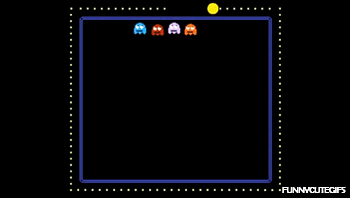

## Description
* **Name:** [Crypto01]http://ctf.securityhighschool.es/challenges?category=crypto)
* **Tag:** Crypto
<p align="center">

</p>

## Tools
* Firefox Version 60.8.0 https://www.mozilla.org/en-US/firefox/60.8.0/releasenotes/
* base64 (GNU coreutils) 8.30 https://manpages.debian.org/stretch/coreutils/base64.1.en.html

## Writeup

```bash
root@1v4n:~/CTF/SHS2K19/crypto/cryp01# nano get_flag.sh
#! /bin/bash

echo "c2hzMmsxOXtzdXBlcl9mYWNpbH0=" | base64 -d > flag.txt
root@1v4n:~/CTF/SHS2K19/crypto/cryp01_GRANTED# chmod +x get_flag.sh
root@1v4n:~/CTF/SHS2K19/crypto/cryp01_GRANTED# ./get_flag.sh
root@1v4n:~/CTF/SHS2K19/crypto/cryp01_GRANTED# cat flag.txt
shs2k19{super_facil}
```

<p align="center">

</p>

### Flag

`shs2k19{super_facil}`
