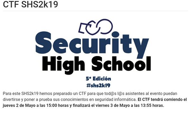

## Description
* **Name:** [Foc01](http://ctf.securityhighschool.es/challenges?category=forense)
* **Tag:** Forense
<p align="center">

</p>

## Tools
* Firefox Version 60.8.0 https://www.mozilla.org/en-US/firefox/60.8.0/releasenotes/
* base64 (GNU coreutils) 8.30 https://manpages.debian.org/stretch/coreutils/base64.1.en.html
* GNU Awk 4.2.1 https://www.gnu.org/software/gawk/

## Writeup
We find the source code of an email with base64 encoding `Content-Transfer-Encoding: base64` .

```bash
root@1v4n:~/CTF/SHS2K19/forense/foc01_GRANTED# md5sum 01_forense.txt
bac5b9ef3438476a7deb12326bd7a6b2  01_forense.txt
root@1v4n:~/CTF/SHS2K19/forense/foc01# file 01_forense.txt
01_forense.txt: SMTP mail, ISO-8859 text, with very long lines, with CRLF line terminators
root@1v4n:~/CTF/SHS2K19/forense/foc01# cat 01_forense.txt
Return-Path: <example_from@example>

X-SpamCatcher-Score: 1 [X]

Received: from [x.x.x.x] (HELO example)

    by fe3.dc.edu (CommuniGate Pro SMTP 4.1.8)

    with ESMTP-TLS id 61258719 for example_to@example2; Fri, 19 Apr 2019 14:23:24

Message-ID: <4129F3CA.2020509@example>

Date: Fri, 19 Apr 2019 14:23:24

From: Taylor Evans <example_from@example>

User-Agent: Mozilla/5.0 (Windows; U; Windows NT 5.1; en-US; rv:1.0.1) Gecko/20020823 Netscape/7.0

X-Accept-Language: en-us, en

MIME-Version: 1.0

To: Pepe Perez <example_to@example2>

Subject: ¿?

Content-Type: text/html; charset=ISO-8859-1

Content-Transfer-Encoding: base64

Message Body:

/9j/4QAYRXhpZgAASUkqAAgAAAAAAAAAAAAAAP/sABFEdWNreQABAAQAAAA8AAD/4QMfaHR0cDovL25zLmFkb2JlLmNvbS94YXAvMS4wLwA8P3hwYWNrZXQgYmVnaW49Iu+7vyIgaWQ9Ilc1TTBNcENlaGlIenJlU3pOVGN6a2M5ZCI/
...
/KxEPJaimZGjl00ZRx/JdS/IVm3bZA5n+uapUp/63koiJ1K2Wmqgk+ZGTx8qBkvyoGYuzdeteqCR/s7zX5qilFQ8b/KiKR26nRRVd9dpqiVGym3rVVEz/APUmvggpjVWBztFoEdaH8VjYPbTpooGu9yt9OlVQj91PVpUaILGPt29dUENt7qeKxsm3wV/zx+O5Z7/onf8AR//ZCmMyaHpNbXN4T1h0dE5ERnNYMll3Y2pOdWN6RmpjMzA9
```
We get an image file (fc9827c094779d477cfa3c650350a67d) that hides a code. Where we will find the flag.

```bash
root@1v4n:~/CTF/SHS2K19/forense/foc01# cat 01_forense.txt | awk '/Body:/{getline;print}' | base64 -d > output
root@1v4n:~/CTF/SHS2K19/forense/foc01# file output
output: JPEG image data, Exif standard: [TIFF image data, little-endian, direntries=0], baseline, precision 8, 600x700, components 3
root@1v4n:~/CTF/SHS2K19/forense/foc01_GRANTED# strings output |less
Exif
Ducky
http://ns.adobe.com/xap/1.0/
<?xpacket begin="
" id="W5M0MpCehiHzreSzNTczkc9d"?> <x:xmpmeta xmlns:x="adobe:ns:meta/" x:xmptk="Adobe XMP Core 5.6-c138 79.159824, 2016/09/14-01:09:01        "> <rdf:RDF xmlns:rdf="http://www.w3.org/1999/02/22-rdf-syntax-ns#"> <rdf:Description rdf:about="" xmlns:xmpMM="http://ns.adobe.com/xap/1.0/mm/" xmlns:stRef="http://ns.adobe.com/xap/1.0/sType/ResourceRef#" xmlns:xmp="http://ns.adobe.com/xap/1.0/" xmpMM:DocumentID="xmp.did:70388413BB4D11E7B590989B83BEC8B4" xmpMM:InstanceID="xmp.iid:70388412BB4D11E7B590989B83BEC8B4" xmp:CreatorTool="Adobe Photoshop CC 2017 Macintosh"> <xmpMM:DerivedFrom stRef:instanceID="D88036E1B4418FFB80D39D89750328B5" stRef:documentID="D88036E1B4418FFB80D39D89750328B5"/> </rdf:Description> </rdf:RDF> </x:xmpmeta> <?xpacket end="r"?>
HPhotoshop 3.0
8BIM
8BIM
x/4b4
...
ZSF)$
mEY6
 m/Dh
IWm@
Nv%dW
kR{Ag.
5V%e
EVr!xkI
Z6U1mv
ZE5@1
kiKQ
lz t
Ar?X
.h=M
+}:UP
o]PCm
c2hzMmsxOXttNDFsX2YwcjNuczFjc30=
root@1v4n:~/CTF/SHS2K19/forense/foc01# printf 'c2hzMmsxOXttNDFsX2YwcjNuczFjc30=' | base64 -d
shs2k19{m41l_f0r3ns1cs}
```
So our solver would fit us

```bash
root@1v4n:~/CTF/SHS2K19/forense/foc01_GRANTED# nano get_flag.sh
#! /bin/bash

cat 01_forense.txt | awk '/Body:/{getline;print}' | base64 -d | awk '/o]PCm/{getline;print}' | base64 -d > flag
root@1v4n:~/CTF/SHS2K19/forense/foc01_GRANTED# cat flag
shs2k19{m41l_f0r3ns1cs}
```

<p align="center">

</p>

### Flag
`shs2k19{m41l_f0r3ns1cs}`
