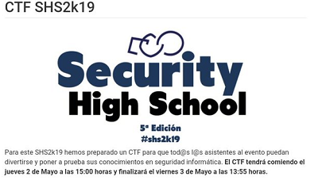

## Description
* **Name:** [Rev01](http://ctf.securityhighschool.es/challenges?category=reversing)
* **Tag:** Reversing
<p align="center">

</p>

## Tools
* Firefox Version 60.8.0 https://www.mozilla.org/en-US/firefox/60.8.0/releasenotes/
* GNU strings 2.31.1
* ltrace version 0.7.3. https://gitlab.com/cespedes/ltrace

## Writeup
We find a [ELF](https://en.wikipedia.org/wiki/Executable_and_Linkable_Format) (4ca45d8f9af5e17f23191835d620a0b) called REV01 .
```bash
root@1v4n:~/CTF/SHS2K19/rev/rev01# md5sum REV01
4ca45d8f9af5e17f23191835d620a0bf  REV01
root@1v4n:~/CTF/SHS2K19/rev/rev01D# file REV01
REV01: ELF 64-bit LSB pie executable, x86-64, version 1 (SYSV), dynamically linked, interpreter /lib64/ld-linux-x86-64.so.2, for GNU/Linux 3.2.0, BuildID[sha1]=3690cec8c683e86dd4dc7cf52176d0ff59e86e87, not stripped
```
We examine the ELF executable with strings funtion and found
```bash
root@1v4n:~/CTF/SHS2K19/rev/rev01# strings REV01 |less
...
shs2k19{H
sup3r_s1H
mpl3_r3vH
3rs1ng}
AWAVI
AUATL
[]A\A]A^A_
You get the flag!
Mmm, nope
...
```
We found a possible chain that will confirm that it is our flag. We confirm with ltrace that the ELF contains the strcmp function (Compare two strings)
```bash
root@1v4n:~/CTF/SHS2K19/rev/rev01# ltrace ./REV01 AAAA
strcmp("AAAA", "shs2k19{sup3r_s1mpl3_r3v3rs1ng}")                                    = -50
printf("Mmm, nope")                                                                  = 9
Mmm, nope+++ exited (status 0) +++
root@1v4n:~/CTF/SHS2K19/rev# ./REV01 shs2k19{sup3r_s1mpl3_r3v3rs1ng}
You get the flag!|
```

<p align="center">

</p>

### Flag
`shs2k19{sup3r_s1mpl3_r3v3rs1ng}`
